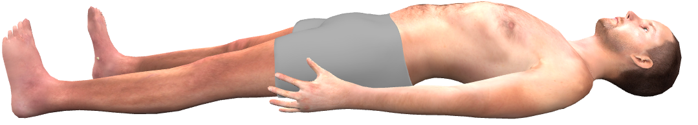

 
 
 
 
 
 

# Pacient se zápalem plic
Do nemocnice je přijat 60 letý automechanik Miloslav Mazánek. Pacient je silný kuřák a několik dní má horečku a nyní se mu už i špatně dýchá. 

<bdl-quiz question="Které vyšetření provedete pro zjištění stavu vnitřního prostředí? Vyberte 1 nejlepší" answers="Laboratorní vyšetření, pH, ABR,...|Ultrazvuk plic|RTG plic|CT plic" correctoptions="true|false|false|false" explanations="Laboratorní vyšetření se nejlépe hodí na stanovení vnitřního prostředí.| Sono se hodí na...| CT se hodí na ... | RTG je pro stanovení nálezu na plicích ..."></bdl-quiz>

