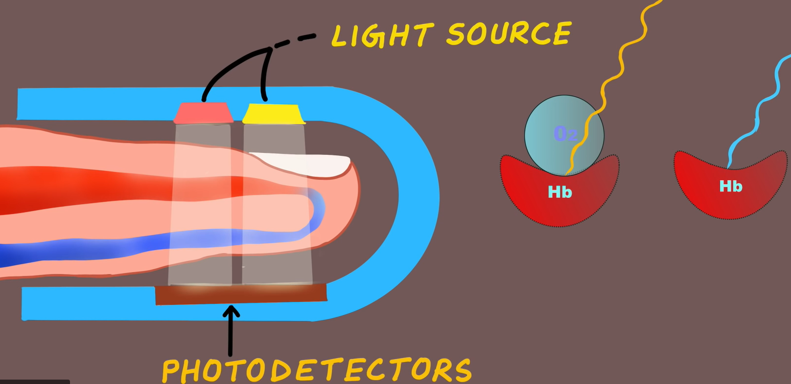

Jan, student medicíny, se chystá s kamarády na výstup na jednu z alpských čtyřtisícovek. Pojede nočním vlakem s přestupem. Sbalil si sebou také několik základních zdravotnických přístrojů. 

Jedním z nich pulzní oxymetr.

<bdl-quiz id="q1" type="choice2" question="Pulzní oxymetr měří ... (vyberte)" answers="koncentraci O2 v krvi|saturaci O2 v hemoglobinu" correctoptions="false|true" explanations="ne, ale koncentrace se dá následně odhadnout dle saturační křivky|ano" buttontitle="zkontrolovat odpověď"></bdl-quiz>
<bdl-quiz id="q2" type="choice2" question="Proč pulzní oxymetr používá dvě různé vlnové délky světla při měření saturace kyslíku v krvi?" answers="Aby rozlišil mezi oxyhemoglobinem a deoxyhemoglobinem|Aby mohl rozlišit mezi pohybující se a nepohybující se krví" correctoptions="true|false" explanations="ano, Oxyhemoglobin (hemoglobin vázaný s kyslíkem) a deoxyhemoglobin (hemoglobin bez kyslíku) absorbují světlo různě|ne" buttontitle="zkontrolovat odpověď"></bdl-quiz>
<bdl-quiz id="q3" type="choice2" question="Pro přesný odhad saturace pulzní oxymetr detekuje" answers="změny v intenzitě světla, která vykazuje pulzní charakter, tj. průtokem krve v artériích a odečte absorpci okolní tkáně, která nevykazuje pulzní změny|změny v pohybující se a nepohybující se krví" correctoptions="true|false" explanations="ano|ne" buttontitle="zkontrolovat odpověď"></bdl-quiz>
<bdl-quiz id="q4" type="choice2" question="Při otravě oxydem uhelnatým" answers="oxymetr měří falešně vysokou hodnotu| oxymetr měří správně nízkou hodnotu" correctoptions="true|false" explanations="ano, karboxyhemoglobin má stejnou schopnost absorbovat světlo jako oxyhemoglobin|ne" buttontitle="zkontrolovat odpověď"></bdl-quiz>
<bdl-quiz id="q5" type="choice2" question="Při anémii" answers="oxymetr měří vysokou saturaci, neindikuje nízkou koncentraci O2|oxymetr měří nízkou saturaci, detekuje nízkou koncentraci O2" correctoptions="true|false" explanations="ano|ne" buttontitle="zkontrolovat odpověď"></bdl-quiz>
<bdl-quiz-control ids="q1,q2,q3,q4,q5"></bdl-quiz-control>

**Obr. Jak funguje pulzní oxymetr.**

