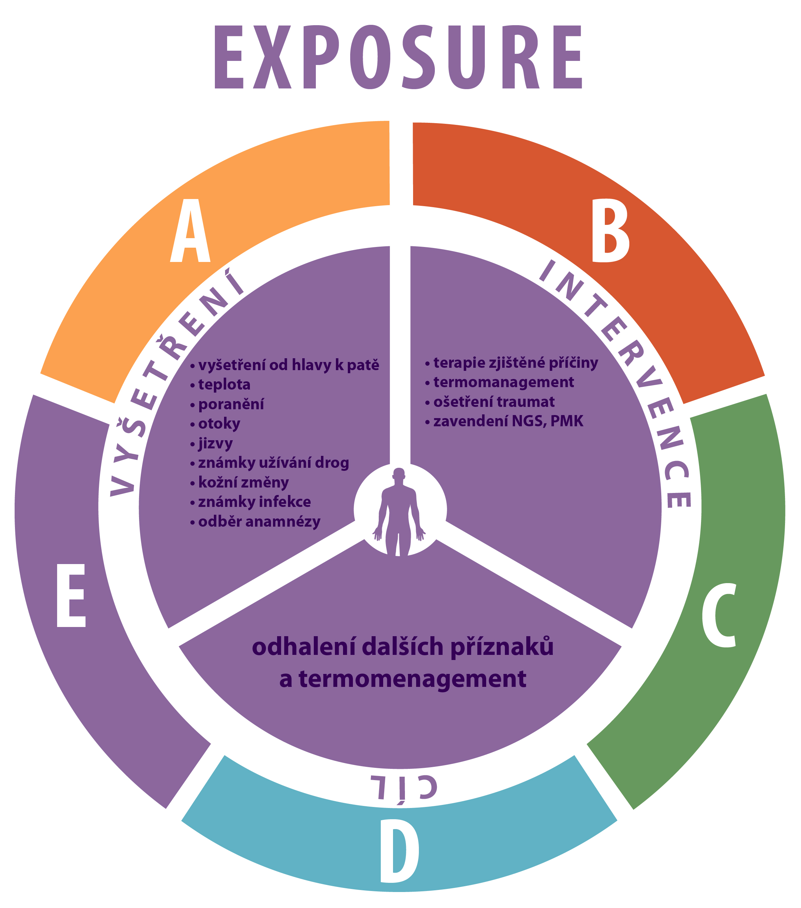

# Uzel 1 - ABCDE vyšetření a anamnéza 

Vsuvka facilitátora: jak ho tedy vyšetříte? ABCDE (možno i u stabilního pacienta, který je při vědomí a dorazil k lékaři po svých) 

A: volně průchozí

B: eupnoe, dýchání poslechově čisté

C: normální tlak, tachykardie, kapilární návrat v normě, periferie teplá, pulz do periferie hmatný

D: bolesti hlavy, GCS 15

E: mírně oschlá sliznice v ústech, kožní turgor v normě, břicho není peritoneální, per rectum nález pouze stolice, bez příměsi hlenu či krve

_Nutné, aby si uvědomili, že u každého pacienta lze požít ABCDE přístup. U průjmů se musí vyšetřit v rámci E stav hydratace, břicho pro vyloučení NPB a per rectum_

23

