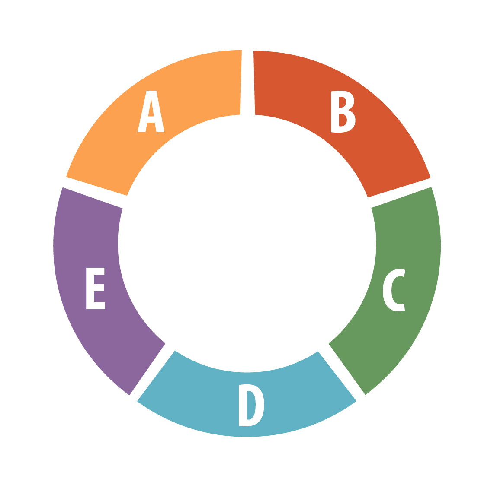

# Uzel 1 – ABCDE vyšetření a anamnéza

Dotaz do pléna: jste lékařem UP, RZP vám veze ženu 26 let s dýchacími potížemi a výsevem kopřivky

?: podle jakého algoritmu budete vyšetřovat? (A - chrapot, oteklý jazyk B – dyspnoe, tachypnoe 26/min, C – Krevní tlak 85/50, Pulz 130/min, pravidelný, závratě, D – GCS 15, strach, E – kopřivka) 

THM: Kdekoli se vyšetřuje, vždy ABCDE (check list pro důležitost)

Napojení na monitor během vyšetření

Odběry: BioChem (KO, koagulace, ionty, CRP, Astrup – doplnit Roman), 

Zdroj obr: Anatolij Truhlář, Zdenek Doubek

4

