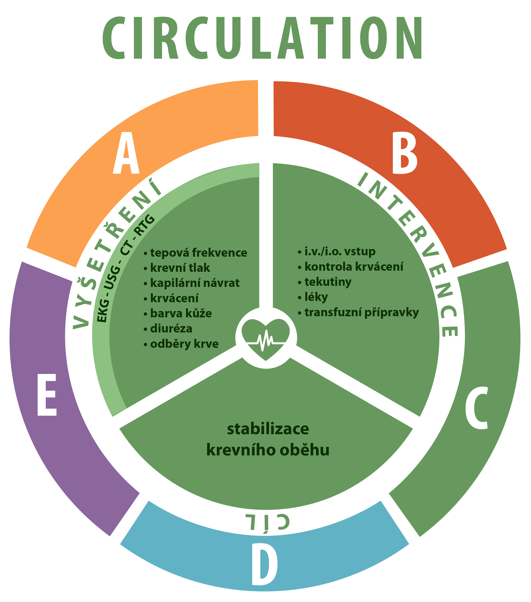

# Uzel 1 – ABCDE vyšetření a anamnéza

Dotaz do pléna: jste lékařem UP, RZP vám veze ženu 26 let s dýchacími potížemi a výsevem kopřivky

?: podle jakého algoritmu budete vyšetřovat? 

A - chrapot, oteklý jazyk

B – dyspnoe, tachypnoe 26/min

C – Krevní tlak 85/50, Pulz 130/min, pravidelný, závratě

4
