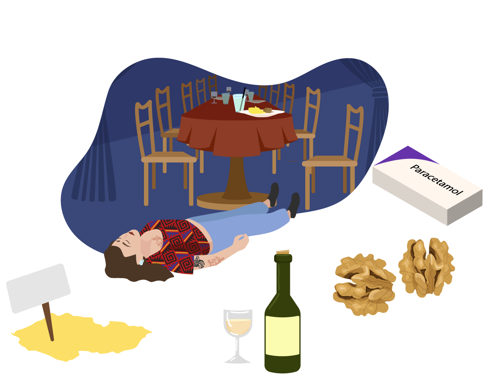

# Odebrání anamnézy

…už u E zjistit, co se stalo…plynulý přechod na Anamnézu

Táňa (scénka: Roman s parukou hraje Táňu) vám se značnou námahou sděluje požadované informace a medici píší zkratky na flip chart:

Mívá vyrážku po požití hotových jídel a po intenzivní fyzické námaze (vyrážka – jídlo a námaha)

V dětství měla ekzém, který se občas objeví i dnes ve formě ohraničených skvrn. Někdy musí postižená místa ošetřit kortikosteroidní mastí (dětství – ekzém).

Od dětství se vyhýbá ořechům, protože podle rodičů na ně kdysi měla divnou reakci .

Ve čtyřech letech jí odebrali nosohltanovou mandli. Od puberty trpí příznaky alergické rýmy.

Oba rodiče jsou živí a zdraví. Otec má alergickou rýmu a ekzém, mladší bratr má astma.

Táňa žije v Chebu. 

Nekouří, vypije 3–4 skleničky bílého vína jednou až dvakrát týdně při obchodních schůzkách.

Užívá paracetamol na menstruační bolesti.
Nebere antikoncepci.

5

