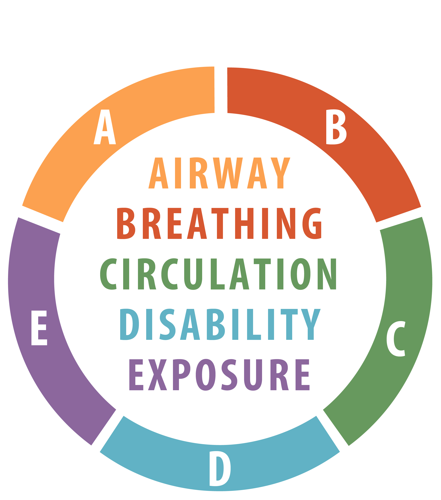

# Uzel 2 - Patofyziologie anafylaxe

Jaké jsou dva klíčové jevy v patofyziologii anafylaxe?
VAZODILATACE a SPAZMUS HLADKÉ SVALOVINY jako dva klíčové     jevy

Proč k nim dochází?

 - uvolnění HISTAMINU.... Překreslit/předělat obrázek na dalším slidu
 - ….flip chart (podle ABCDE popsat, co histamin způsobil):
 - A: otok laryngu, otok jazyka, DCD – spazmus hladké svaloviny, 
 - B: v plicích se hůř dýchá – plicní edém (dyspnoe)
 - C: hypotenze na podkladě vazodilatace
 - D: alterovaný neurologický stav (podklad hypotenze)
 - E: kožní projevy (svědění, vyrážka)

8

