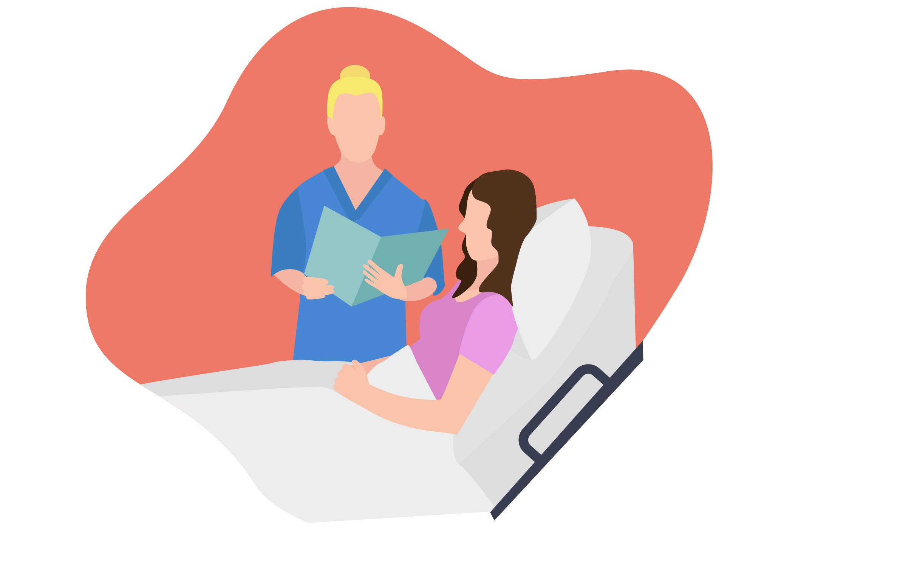

# Uzel 4 - Pokračování v léčbě

Po dvou hodinách se stav pacientky normalizuje.

Ordinované odběry, které mezitím dorazily, jsou bez pozoruhodností. 

Pošlete Táňu domů? – ano/NE a proč? Diskuze…

Hospitalizujete ji přes noc – alergen se nemusí stihnout odbourat a po odeznění účinku AD může dojít k refrakterní rci

Jak potvrdíte, že se skutečně jednalo o anafylaxi? – tryptáza (provádí se 2 odběry - 1. hned po tom,

co zjistíme, že by se mohlo jednat o anafylaxi, 2. pak za 24 hod.

O čem ji dále poučíte? (navštívit alergologa, nosit u sebe Epipen)
- Prick Testy (rychlý dotaz; pozn. Nedělat v den, kdy brala antihistaminika)

17
