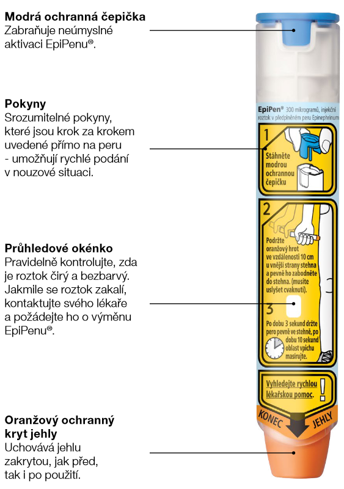

# Epipen

EpiPen ®
/EpiPen ® Jr. je předplněné injekční pero k jednorázovému
použití, kterým se podává adrenalin v případě těžké alergické reakce.
Autoinjektor EpiPen ®
/EpiPen ® Jr. je vytvořen tak, aby ho mohl použít
pacient na podání injekce standardizované dávky adrenalinu do
stehna, pokud u něj dojde k život ohrožující anafylaktické reakci.
Každý EpiPen ®
/EpiPen ® Jr. lze použít pouze jednou.

19
