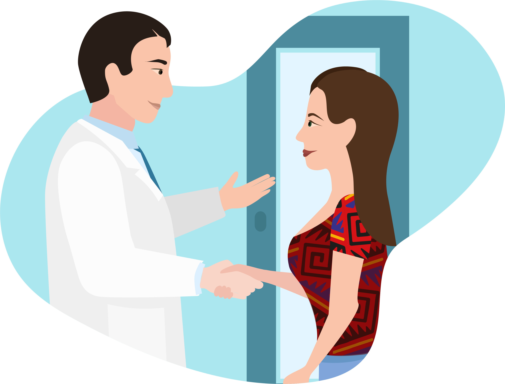

# Konec první části

Uběhlo 12 hodin, během kterých byla Táňa stabilní na monitorovaném lůžku.
Mezitím dorazila i hladina sérové tryptázy, která je u Táni silně zvýšená. V tuto chvíli tak máte, kromě kliniky, i laboratorní důkaz o tom, že v těle Táni proběhla anafylaktická reakce.
Táňa se chystá na odchod domů.

21

