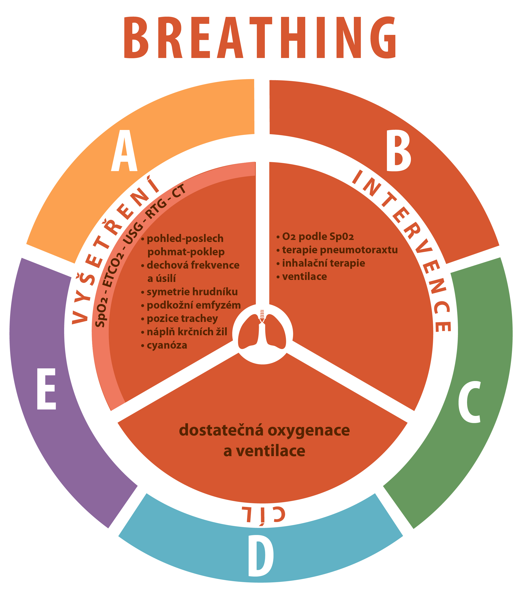

# ABCDE vyšetření a anamnéza

A - chrapot, dušnost, kašel

B – dyspnoe, tachypnoe 26/min

<!--
Kazuistika 1. (Model – akutní stav, snížená alveolární ventilace z plicní obstrukce a snížená difuze plynů z intersticiálního zánětu.)
A. 60-letý pán je přijat do nemocnice s akutním zápalem plic, Dlouholetý kuřák.
Horečka, dušnost
Labolatorní hodnoty:
–         pH   7.12
–         pO2   60 mmHg
–         pCO2   80 mmHg
–         HCO3-     25 mmol/ l
–         BE = 1 mmol/L
Otázka:  O jakou poruchu se jedná?
•          Jaké jsou její pravděpodobné příčiny?
 
B. Pokračování (Model – chronický stav, snížená alveolární ventilace z dlouhodobé plicní obstrukce)
O pár let později, tento muž přichází do vaší ambulance
•          Již několik let sledován pro chronickou bronchitis a emfyzém (COPD)
•          Nepociťuje větší dušnost než obvykle
•          Laboratorní hodnoty:
–         pH   7.32
–         pO2   60 mmHg
–         pCO2   80 mmHg
–         HCO3-     32 mmol/ l
–         BE = 12 mmol/L
Otázka:  O jakou poruchu se jedná?
Jaké jsou její pravděpodobné příčiny? 
-->