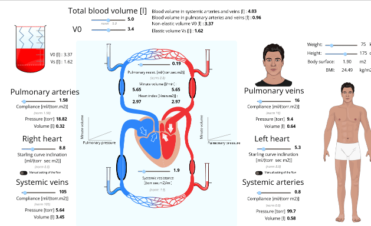
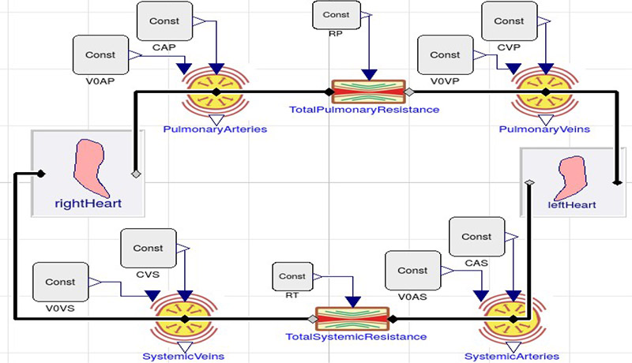

fig 1. screencast of circulation. The screencast shows manipulating of the human body parameters, weight and height. And the failure of right heart is simulated with manual setting of it's cardiac output to 2 l/min. The compensation by Frank-Starling law cause the left heart cardiac output to match 2 l/min as well after a while.

Simulator of circulation is based on non-pulsatile model of cardiovascular system.

Model published in [1] and it's modelica diagram bellow consist of non-pulsatione left herat and right heart connected via systemic and pulmonary circulation modelled as resistance and elastance simplified to one component.

[1] Kulhánek T, Tribula M, Kofránek J, Mateják M. Simple models of the cardiovascular system for educational and research purposes. MEFANET Journal 2014; 2(2): 56-63. Available at WWW: http://mj.mefanet.cz/mj-04140914

