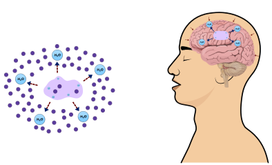
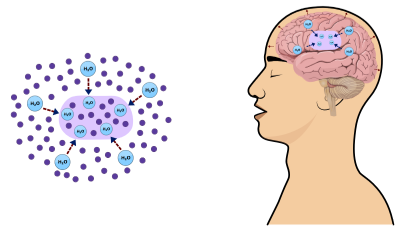
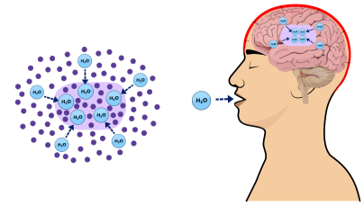

# Dehydratation

**Dehydratation** - cells tend to shrink, due to passive loss water

**Compensation** - cells actively pump ions to keep volume and reduce water loss

**Rehydratation too fast** - cells contains ions with higher osmolarity, water tends
to flow into cells, organ may swell, may cause cerebral edema.

