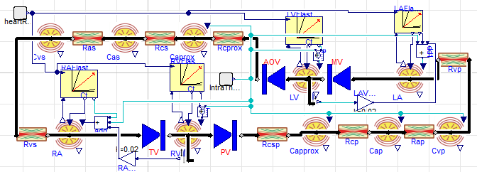

**fig 1.** Model of Hemodynamics in Modelica.

**fig 2.** Sample screencast of simulator. You may change heartrate and inotropy to see the effect in PV diagram and pressure and volume of left heart.

# Hemodynamics of cardiovascular system

The following simulator is based on Burkhof's model implemented in Physiolibrary 2.0 
and presented [^1], see the diagram in fig 1.

The simulation on the following page is dynamic. See the screencast in fig. 2 showing dynamic changes of model variables (pressure, volume, PV diagram) of left heart are shown when the parameters are changed:
  * heart rate
  * inotropy
  * specific positive and negative inotropic agent
  
Simulator is used in a prototype educational app [^2].  

[^1]: Lumped Models of the Cardiovascular System of Various Complexity by Filip Ježek, Tomáš Kulhánek, Karel Kalecký and Jiří Kofránek. DOI: [10.1016/j.bbe.2017.08.001](https://doi.org/10.1016/j.bbe.2017.08.001)
[^2]: https://bodylight.physiome.cz/Bodylight-Scenarios/hemodynamics/

