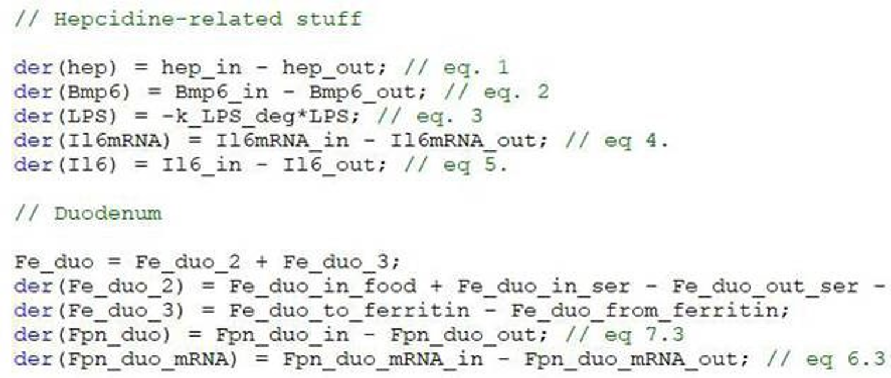
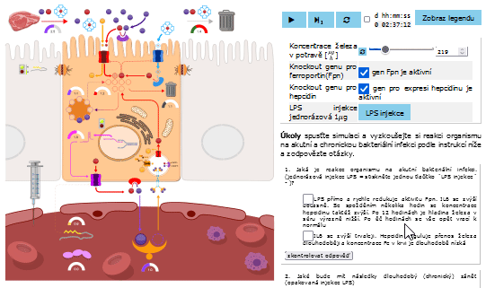

fig 1. model definition in Modelica as equations. Differential equations as in referenced papers.

fig 2. screencast of model simulator showing effect of LPS injection (mimics bacterial infection) on the level of iron in blood.

# Iron metabolism in duodenum

The ironmetabolism simulator is based on the model described in [1-4]. The simulator is used in more detailed educational material app (in Czech language only) [^1].

**References:**

  [1] Enculescu M, Metzendorf C, Sparla R, Hahnel M, Bode J, et al. (2017) Modelling Systemic Iron Regulation during Dietary Iron Overload and Acute Inflammation: Role of Hepcidin-Independent Mechanisms. PLOS Computational Biology 13(1): e1005322. https://doi.org/10.1371/journal.pcbi.1005322
  
  [2] Kemna EH, Tjalsma H, Willems HL, Swinkels DW (January 2008). "Hepcidin: from discovery to differential diagnosis". Haematologica. 93 (1): 90–7. doi: https://doi.org/10.3324/haematol.11705 
  
  [3] Bento, I., Peixoto, C., Zaitsev, V. N. & Lindley, P. F. (2007). Ceruloplasmin revisited: structural and functional roles of various metal cation-binding sites.  Acta Cryst. D63, 240-248. https://doi.org/10.1107/S090744490604947X
  
  [4] Lipocalin 2: An Emerging Player in Iron Homeostasis and Inflammation Xia Xiao, Beng San Yeoh, Matam Vijay-Kumar Annual Review of Nutrition 2017 37:1, 103-130 https://doi.org/10.1146/annurev-nutr-071816-064559 

[^1]: https://bodylight.physiome.cz/Bodylight-Scenarios/ironmetabolism/

