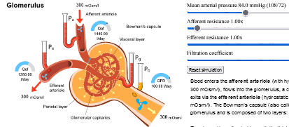

fig 1. screencast of nefron model simulator.

# Nefron model and simulator

The model is implemented in Modelica and proposed extension PDE Modelica [^1][^2] and was used to demonstrate new Bodylight technology to deliver true client web simulation. 

Use the navigation to follow multiple pages in the simulator. 

[^1]: Šilar J, Polák D, Mládek A, Ježek F, Kurtz T, DiCarlo S, Živný J, Kofranek J
Development of In-Browser Simulators for Medical Education: Introduction of a Novel Software Toolchain
J Med Internet Res 2019;21(7):e14160
URL: https://www.jmir.org/2019/7/e14160
DOI: 10.2196/14160
[^2]: Jan Šilar, Filip Ježek & Jiří Kofránek (2017): PDEModelica1: a Modelica
language extension for partial differential equations implemented in OpenModelica, International
Journal of Modelling and Simulation, DOI: 10.1080/02286203.2017.1404417

