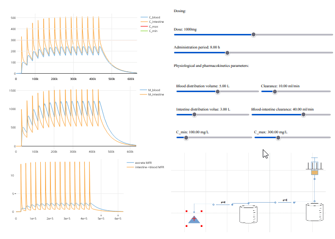

fig 1. screencast of changing parameters of PKPD model.

# Pharmacokinetic and Pharmacodynamic

The model is based on library for PKPD models in Modelica (not yet published). 

In screencast fig 1. you see dosage and safe therapeutic concentration in blood plasma
where minimum, maximum limits, dosage and distribution and others can be set.

