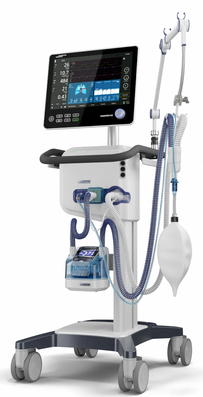

# Respiratory failure and artificial breathing 

v1.4.2&nbsp;

Simulation control: <bdl-fmi id="idfmi" mode="continuous" src="modelECMORespiratoryVR_ECMOSimNoRegVentilatorVC4.js" fminame="modelECMORespiratoryVR_ECMOSimNoRegVentilatorVC4" tolerance="0.0000001" starttime="0" fstepsize="0.2" fpslimit="5" guid="{35ce3a9c-e1e3-4664-9848-4222b949f268}" valuereferences="637537985,905970425,905969984,905970853,905970388,905969947,905970816,16777229,16777230,16777583,16777584,16777585,16777223,100663306,16777224,16777225" valuelabels="lungs.volume,Veins.chemicalSolution.bloodGases.sO2,Arteries.chemicalSolution.bloodGases.sO2,Tissue.chemicalSolution.bloodGases.sO2,Veins.chemicalSolution.bloodGases.pH,Arteries.chemicalSolution.bloodGases.pH,Tissue.chemicalSolution.bloodGases.pH,RR,TV,ventilatorSCMV.Iratio,ventilatorSCMV.Eratio,ventilatorSCMV.pause,AirO2,AirN2,AirCO2,AirH2O" inputs="idrate,16777229,1,60,t;idtv,16777230,1,1000000,t;idiratio,16777583,1,1,t;ideratio,16777584,1,1,t;idpause,16777585,1,100,t;ido2,16777223,1,100,t;idco2,16777224,1,100,t;idh2o,16777225,1,100,t;idshunts,16777226,1,100,t;iddeadspace,16777231,1,1000000,t" inputlabels="RR,TV,ventilatorSCMV.Iratio,ventilatorSCMV.Eratio,ventilatorSCMV.pause,AirO2,AirCO2,AirH2O,Shunts,DV"></bdl-fmi>
Patient state:  
<bdl-buttonparams title="Normal" ids="idshunts,iddeadspace" values="2,150" fromid="vrapi" thresholdvalue="0" refindex="5" ></bdl-buttonparams> 
<bdl-buttonparams title="Moderate respiration failure" ids="idshunts,iddeadspace" values="38,400" fromid="vrapi" refindex="5" thresholdvalue="1"></bdl-buttonparams> 
<bdl-buttonparams title="Severe failure" ids="idshunts,iddeadspace" values="58,450" fromid="vrapi" refindex="5" thresholdvalue="2"></bdl-buttonparams> 
<bdl-range id="patientstate" title="patient state" min="0" max="3" step="1" default="1" fromid="vrapi" refindex="5"></bdl-range>

Ventilated gas: <!--bdl-buttonparams title="Normal" ids="ido2,idco2,idh2o" values="21,0.03,6"></bdl-buttonparams>
<bdl-buttonparams title="O2 40%" ids="ido2,idco2,idh2o" values="40,0.03,6"></bdl-buttonparams>
<bdl-buttonparams title="O2 60%" ids="ido2,idco2,idh2o" values="60,0.03,6"></bdl-buttonparams-->
<bdl-range id="ido2" title="O2 %" min="5" max="93" default="21" fromid="vrapi" refindex="4"></bdl-range> 

<bdl-range id="iddeadspace" title="dead space" min="100" max="4500" default="400"></bdl-range>
<bdl-range id="idshunts" title="L-V shunts %" min="5" max="95" default="38"></bdl-range>
<bdl-range id="idco2" title="CO2 %" min="0" max="10" default="0.03" step="0.01"></bdl-range>
<bdl-range id="idh2o" title="H2O %" min="0" max="10" default="6" step="0.1"></bdl-range>

Mechanical ventilator setting: 
<bdl-range id="idrate" title="Breathing rate (1/min)" min="1" max="120" default="12" step="1" fromid="vrapi" refindex="3"></bdl-range> 
<!--bdl-range id="idmuscle" title="Breathing force (%)" min="10" max="400" default="100" step="1" fromid="vrapi" refindex="0"></bdl-range-->
<bdl-range id="idtv" title="Vt - tidal volume (ml)" min="200" max="1000" default="500" step="1" fromid="vrapi" refindex="2"></bdl-range> 

<bdl-range id="idiratio" min="1" max="4" default="1" step="1"fromid="vrapi" refindex="1"></bdl-range>
<bdl-range id="ideratio" min="1" max="9" default="4" step="1" fromid="vrapi" refindex="0"></bdl-range>

Set I:E ratio 
<bdl-buttonparams title="1:1" ids="idiratio,ideratio" values="1,1"></bdl-buttonparams>
<bdl-buttonparams title="1:2" ids="idiratio,ideratio" values="1,2"></bdl-buttonparams>
<bdl-buttonparams title="2:1" ids="idiratio,ideratio" values="2,1"></bdl-buttonparams>
<bdl-buttonparams title="3:2" ids="idiratio,ideratio" values="3,2"></bdl-buttonparams> 
<bdl-range id="idpause" title="pause (%)" min="0" max="70" default="0" step="1" fromid="vrapi" refindex="6"></bdl-range>

<!--bdl-fmi id="idfmi" mode="continuous" src="MinimalRespiration.js" fminame="MinimalRespiration" tolerance="0.000001" starttime="0" fstepsize="0.2" guid="{d0393898-9a87-4ac9-904f-355fd73a976f}" valuereferences="637536225,905969702,905969728,16777228,16777223" valuelabels="lungs.volume,pCO2.partialPressure,pO2.partialPressure,Pmin,RespiratoryRate" inputs="idrate,16777223,1,60,t;idmuscle,16777228,-1000,100,t" inputlabels="RespirationRate,Pmin" fpslimit="5"></bdl-fmi-->

<bdl-chartjs-time width="300" height="150" fromid="idfmi" labels="lungs volume"  refindex="0" refvalues="1"></bdl-chartjs-time>
<bdl-chartjs-time width="300" height="150" fromid="idfmi" labels="sO2 veins,sO2 arteries,sO2 tissues" refindex="1" refvalues="3"></bdl-chartjs-time>

API to VR
<bdl-remote-value remoteurl="http://127.0.0.1:5000/vrapi" interval="1000" id="vrapi" inputs="volume;sO2"></bdl-remote-value>

Data to be sent to VR: 
volume:<bdl-range id="volume" title="Lung volume (m3)" min="0.0001" max="0.01" default="0.002" step="0.000001" fromid="idfmi" refindex="0"></bdl-range>
sO2:<bdl-range id="sO2" min="0" max="1" default="0" step="0.01" title="so2"  fromid="idfmi" refindex="2"></bdl-range>

Data that can be changed from VR: 
<bdl-chartjs-time width="300" height="90" fromid="idfmi" labels="RR" initialdata="0" refindex="7" refvalues="1"></bdl-chartjs-time>
<bdl-chartjs-time width="300" height="90" fromid="idfmi" labels="Vt (mandatory tidal volume)" initialdata="" refindex="8" refvalues="1"></bdl-chartjs-time>
<bdl-chartjs-time width="300" height="90" fromid="idfmi" labels="I,E ratio" initialdata="" refindex="9" refvalues="2"></bdl-chartjs-time>
<bdl-chartjs-time width="300" height="90" fromid="idfmi" labels="pause %" initialdata="" refindex="11" refvalues="1"></bdl-chartjs-time>
<bdl-chartjs-time width="300" height="90" fromid="idfmi" labels="O2 %" initialdata="" refindex="12" refvalues="1" convertors="100,1"></bdl-chartjs-time>

