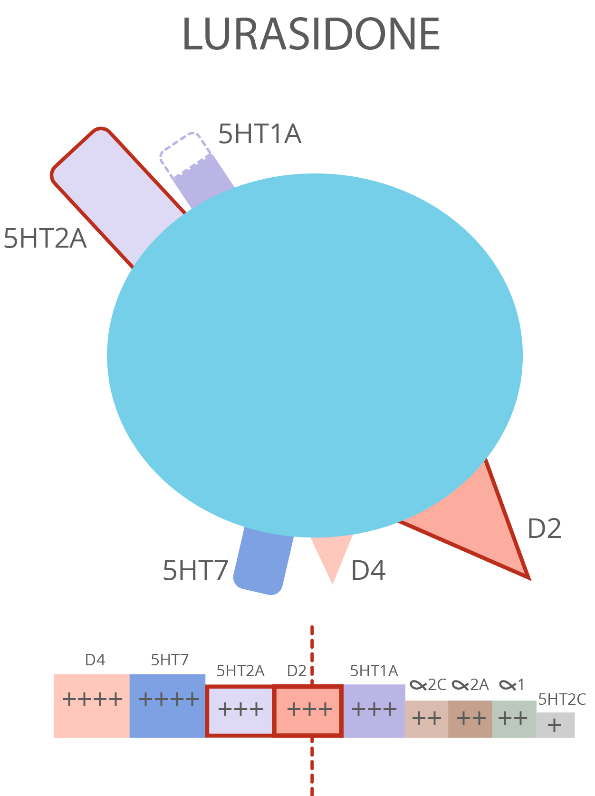

# Virtual patient case reports demo

Following pages was inspired by the case reports presented in LAURIE project https://cs.laurie-project.com/scenario/19/node/Mzgy

Following pages shows some of the graphics with context (CZ only):