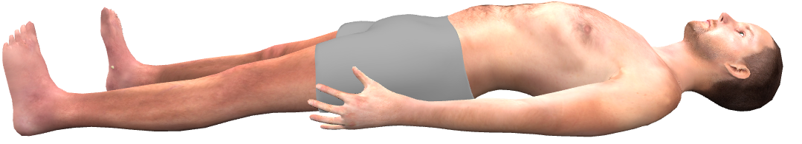

**Ovládání figuríny**
<bdl-remote-value remoteurl="https://patf-lab06.lf1.cuni.cz:5000/lungsim" interval="2000" id="lungsim" inputs="rate;muscle_pressure;blend_duration;compliance;peep;resistance;run"></bdl-remote-value><bdl-chartjs-time id="id11" width="200" height="80" fromid="lungsim" refindex="7" refvalues="1" labels="tidal volume"></bdl-chartjs-time> <a href="https://patf-lab06.lf1.cuni.cz:5000/manequin" target="_blank">enable certificate</a>

**Human simulator <bdl-checkbox id="run" default="true" titlemin="STOPPED" titlemax="RUNNING"></bdl-checkbox> **
<!--bdl-range id="rate" min="0" max="100" default="7" step="0.5" title="breath rate [1/min]"></bdl-range><br/-->

<bdl-range id="blend_duration" min="1" max="10" default="4" step="1" title="how many breaths to change value [1]"></bdl-range> 
<bdl-range id="compliance" min="0.5" max="250" default="50" step="0.5" title="Compliance [ml/cmH2O]"></bdl-range> 
<bdl-range id="muscle_pressure" min="0" max="100" default="33" title="Muscle Pressure [cmH2O]"></bdl-range> 
<bdl-range id="peep" min="4" max="8" default="5" title="Initial pressure [cmH2O]"></bdl-range> 
<bdl-range id="resistance" min="8" max="150" default="35" title="Resistance [cmH2O/(l.s)]"></bdl-range> 
<!--bdl-range id="status" min="0" max="150" default="" title="Helper - use for state"></bdl-range><br/-->

<bdl-buttonparams title="Normální dýchání" ids="blend_duration,compliance,muscle_pressure,peep,resistance,rate" values='4,50,33,5,35,17'></bdl-buttonparams>
<bdl-buttonparams title="Kussmaulovo dýchání" ids="blend_duration,compliance,muscle_pressure,peep,resistance,rate" values='4,50,50,5,15,25'></bdl-buttonparams>

**Ovládání výuky CZ**
<bdl-fb-config api-str="6beb9cc2eaec52b92e54c60a:14def138125db28da79302f38602fbd3ed4acdf9f1380a72b1e3e384c40e5f164e1b72d07eb98827af0df577fe63b8f48f9f3de3a3208d12b25f8c62bae076ff4f79105c91fa9f1e68bc3939063c975f15081254ac2010d0a7678bc9aa1201757b65bfaa2028956ea97868faa7ff9aa3c1c157dd73fd898c6a2a448d0de54b7e9482ff2057cee4df84727a1a2c683236abab0fc6a50f100fa84360efcb12d5d1fd5abf73a9b4ee07f934d04444debe32f62f46da9446c7a9b23af7a9e43a7f38ae383f204ebce87a511f8a3648127a6248243630d6e95c7496284d2d36db48123fe3ade5ea055beb96ad05427506f83b5aa52bc6ba5ee911bc627c86b0c47ca92f0b15a0a36b198ec26586d96dc87d1f6364ce012b3bfd1e87217f15ac05d110fc17320617d7177d2de7b7a7b99f8c5454966bb57103253c5e214bb64579e5319251f3eb87a7d7d3406ea7cbfa0c4a95000c150c254b26e14444e0f55099f2fd174bffa9f395a8aaa60ce504516c9fc7:ce520f6aa563b22a45ddf894bb9224e4" listen="true"></bdl-fb-config>
<bdl-fb-set-state title="0.Úvod" value="index.md"></bdl-fb-set-state>

<bdl-fb-set-state title="1.Simulace" value="screen/k1uvod.md"></bdl-fb-set-state>

<bdl-fb-set-state title="2.Vyš. krevního obrazu a biochemie" value="screen/k2vysetreni.md"></bdl-fb-set-state>

<bdl-fb-set-state title="3.Vyš. ASTRUP a ABR" value="screen/k3vysetreniastrup.md"></bdl-fb-set-state>

<bdl-fb-set-state title="4.Léčba Vše" value="screen/k4lecba.md"></bdl-fb-set-state>

<bdl-fb-get-state tohash="true"></bdl-fb-get-state>

**Control Seminar (EN)**
<bdl-fb-set-state title="0.Intro" value="index.md"></bdl-fb-set-state>

<bdl-fb-set-state title="1.Simulation" value="screen/k1simulation-en.md"></bdl-fb-set-state>

<bdl-fb-set-state title="2.Exam blood" value="screen/k2exam-blood-en.md"></bdl-fb-set-state>

<bdl-fb-set-state title="3.Exam Astrup and biochemistry" value="screen/k3exam-astrup-en.md"></bdl-fb-set-state>

<bdl-fb-set-state title="4.Treatment" value="screen/k4treatment-en.md"></bdl-fb-set-state>

<bdl-fb-get-state tohash="true"></bdl-fb-get-state>

