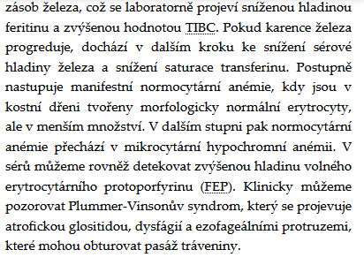
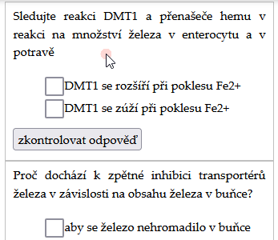

# Úvod

*[Tfr]: transferrin

Následující interaktivní text představí hlavní moderní představy o metabolismu železa a jeho roli ve fyziologii a patofyziologii člověka.

|  |  |
|--|--|
| Pro výběr konkrétní obrazovky použijte odkazy v levém panelu. |  |
| Pro navigaci zpět a vpřed použijte tlačítka v dolní liště. |  |
| V textu se vyskytují zkratky, např. Tfr, jejich vysvětlení se objeví při najetí kurzoru myši na ni. |  |
| Na konci každé podkapitoly je simulátor s instrukcemi a interaktivními tlačítky, posuvníky |  |
| Občas se objeví v textu otázky a možné odpovědi, tlačítkem lze zobrazit správné odpovědi. |  |
