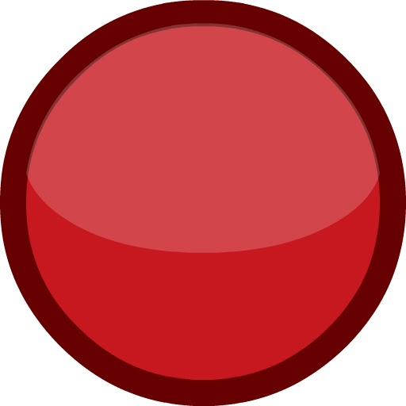

*[DMT1]: divalent metal transporter 1 | Divalent Metal Transporter 1 je protein, který transportuje dvojmocné ionty kovů zejména Fe2+, Zn2+, Cd2+ aj.|https://en.wikipedia.org/wiki/Natural_resistance-associated_macrophage_protein_2
*[Dcytb]: duodenal cytochrome b | duodenal cytochrome b je enzym, který katalyzuje redukci iontů železa Fe3+ na Fe2+ https://en.wikipedia.org/wiki/Duodenal_cytochrome_B

**Obrázek: duodenum a enterocyty** - schéma umístění buněk duodena v trávícím systému.

Železo se vstřebává v tenkém střevě v duodenu na membránách enterocytů.

## Nehemové železo

Nehemové železo může být ve dvou oxidačních stavech: __trojmocný - železitý iont__ (Fe3+)  nebo __dvojmocný - železnatý iont__ (Fe2+) . Trojmocné železo snadno tvoří komplexní sloučeniny s anionty, není rozpustné pro pH > 3 a proto se hůře absorbuje. Naopak dvojmocné železo je rozpustné až do pH ~ 8 a netvoří snadno v prostředí gastrointestinálního traktu komplexní sloučeniny. Askorbová kyselina (vitamin C) reaguje s ionty železa za vzniku rozpustných komplexů a __redukuje trojmocné železo na dvojmocné__, čímž efektivně zvyšuje jeho absorpci. Taniny (polyfenolické látky, tzv. třísloviny), obsažené například v čaji, tvoří s železem nerozpustné komplexy a tak snižují jeho vstřebávání. 

<bdl-quiz type="choice2"
question="Pokud si k salátu dám čaj obsahující taniny (třísloviny), jak se změní absorpce nehemového železa ve střevě?" 
answers="Absorpce se sníží|Absorpce se zvýší|Absorpce zůstane nezměněna"
correctoptions="true|false|false" 
explanations="Taniny obsažené v čaji, tvoří s železem nerozpustné komplexy a tak snižují jeho vstřebávání| | "
buttontitle="zkontrolovat odpověď"></bdl-quiz>

 

