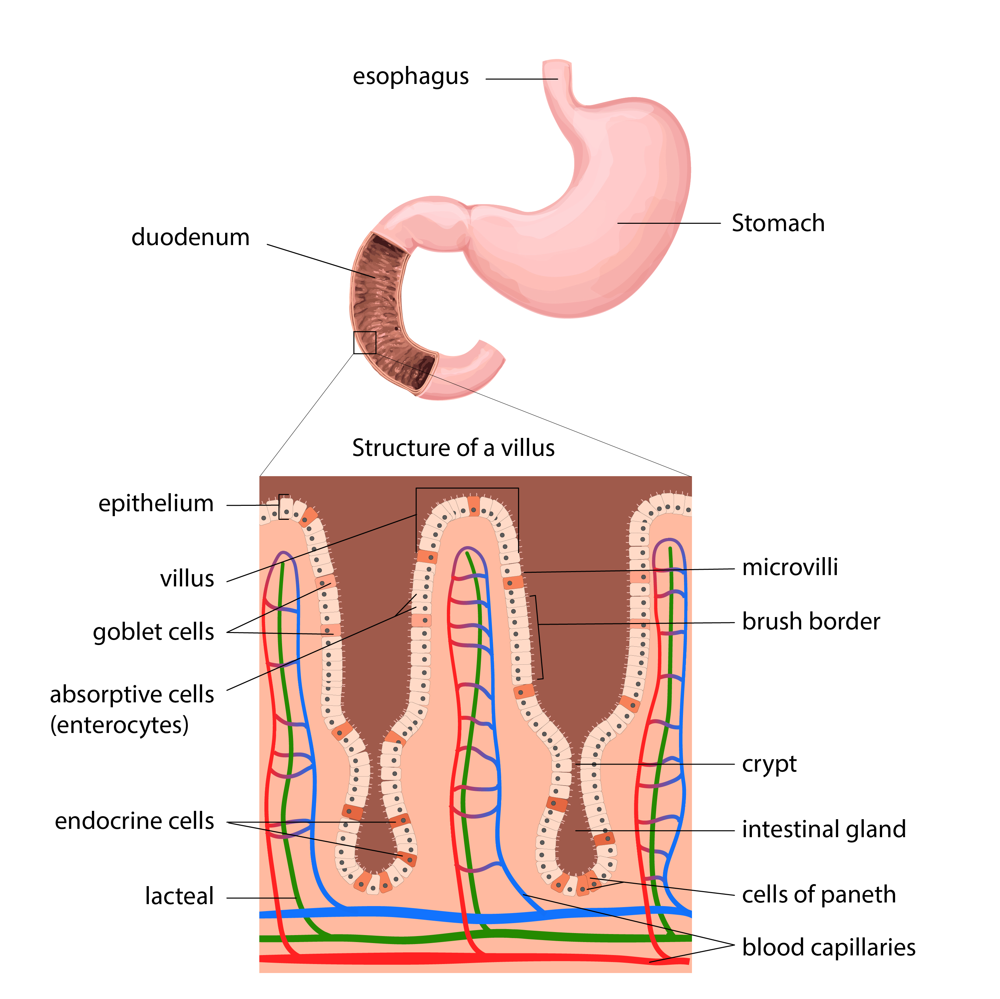
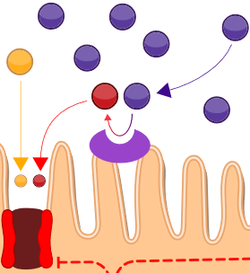

*[DMT1]: divalent metal transporter 1
*[Dcytb]: duodenal cytochrome b

**Obrázek: duodenum a enterocyty** - schéma umístění buněk duodena v trávícím systému.

**Obrázek: membrána enterocytu duodena** - schéma přenosu nehemového železa do buňky v duodenu. Na povrchu buňky tzv. mikrovilly a Dcytb. Přenáší se Fe2+ přes DMT1.

Nehemové železo může být ve dvou oxidačních stavech: __trojmocný - železitý iont__ (Fe3+)  nebo __dvojmocný - železnatý iont__ (Fe2+) . Trojmocné železo snadno tvoří komplexní sloučeniny s anionty, není rozpustné pro pH > 3 a proto se hůře absorbuje. Naopak dvojmocné železo je rozpustné až do pH ~ 8 a netvoří snadno v prostředí gastrointestinálního traktu komplexní sloučeniny. Askorbová kyselina (vitamin C) reaguje s ionty železa za vzniku rozpustných komplexů a __redukuje trojmocné železo na dvojmocné__, čímž efektivně zvyšuje jeho absorpci. Taniny (polyfenolické látky, tzv. třísloviny), obsažené například v čaji, tvoří s železem nerozpustné komplexy a tak snižují jeho vstřebávání. 

Pro pohyb iontů železa mezi buňkou a vnějším prostředím je potřeba jeden nebo více specializovaných proteinových přenašečů, které usnadňují jejich přenos. Absorpce nehemového železa je omezena na __duodenum__. Na apikální straně duodenálních enterocytů se nachází __transportér divalentních kovů (DMT1)__  , který kotransportuje Fe2+ a H+ z luminální strany do buňky. Energii pro přenos železa zajišťuje elektrochemický gradient protonů, který je udržován pomocí Na+/H+ antiportu. DMT1 přenáší i jiné dvojmocné kovy, včetně těch, které jsou pro tělo toxické (Cd2+, Pb2+).

Pro přenos trojmocného železa do enterocytu je nutné jej nejprve převést na dvojmocnou formu. Tento proces je katalyzován __duodenální cytochrom b reduktázou (Dcytb)__ , která je lokalizovaná na apikální membráně enterocytu. Množství Dcytb roste při nedostatku železa nebo ve stavu hypoxie což přispívá ke zvýšení podílu absorbovaného železa. Pro správnou funkci Dcytb je potřeba askorbát, který poskytuje elektrony pro redukci.

Po vstupu do enterocytu se Fe2+ stává součástí malého “pohotového poolu” železa. Nitrobuněčná koncentrace železnatých iontů je udržována velmi nízká a to z důvodu jejich toxicity. V přítomnosti peroxidu vodíku dochází v rámci __Fentonovy reakce__ ke vzniku vysoce reaktivního OH radikálu.

<bdl-quiz 
question="Pokud si k salátu dám čaj obsahující taniny (třísloviny), jak se změní absorpce nehemového železa ve střevě?" 
answers="Absorpce se sníží|Absorpce se zvýší|Absorpce zůstane nezměněna"
correctoptions="true|false|false" 
explanations="Taniny obsažené v čaji, tvoří s železem nerozpustné komplexy a tak snižují jeho vstřebávání| | "
buttontitle="zkontrolovat odpověď"></bdl-quiz>

 

