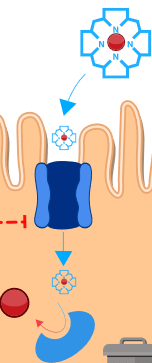
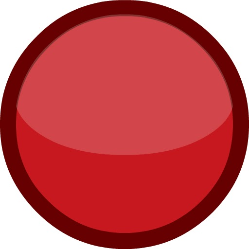
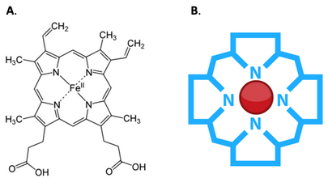

## 1.2. Hemové železo

V evropských podmínkách je hlavním zdrojem železa __hem__, který je obsažený především v potravinách živočišného původu, nejvíce v červeném mase a vnitřnostech. 

  **Obrázek** - schéma 
  přenosu hemu do buňky.

Hemová forma může, dle diety, představovat až 2/3 celkového příjmu železa. Hem je prostetická skupina obsahující tetrapyrolové jádro, centrálně vázaný iont Fe2+ a postranní substituenty (Obrázek HEM). Typický pro hem je konjugovaný systém dvojných vazeb, který dává hemu červenou barvu. Hem je obsažený v mnoha důležitých biologických makromolekulách jako například hemoglobin, myoglobin, cytochrom P450, peroxidáza nebo cytochromy dýchacího řetězce.

Hemové železo je absorbováno duodenálními enterocyty. Mechanismus přenosu není znám, nicméně předpokládá se navázání hemu na příslušný proteinový přenašeč, který je součástí kartáčového lemu duodena, případně může být přenos endocytický. Uvnitř buňky je dvojmocné železo uvolněno z tetrapyrolového kruhu hemu pomocí enzymu __hem oxygenázy (HO)__ . Do reakce vstupuje molekulární kyslík a NADPH + H+, výsledkem reakce je pak volné Fe2+ , které se stává součástí pohotového poolu, oxid uhelnatý a biliverdin, který je dále redukován na bilirubin. 

<pdbe-molstar molecule-id="2h35" hide-controls="true" hide-polymer="true" bg-color-r="255" bg-color-g="255" bg-color-b="255"></pdbe-molstar>

__Obrázek HEM__. interaktivní 3D obrázek 
proteinu 2h35 (lidský hemoglobin) s prostorovou 
vizualizací hemových skupin, polymerová struktura 
hemoglobinu skryta (myší můžete rotovat) A. Molekulární struktura hemu, B. Schématické znázornění hemu, modře: tetrapyrolové porfyrinové jádro, červeně: centrálně vázaný iont Fe2+.

<bdl-quiz 
question="Kolik hemových skupin je v hemoglobinu" 
answers="1|2|3|4"
correctoptions="false|false|false|true" 
explanations=""></bdl-quiz>

