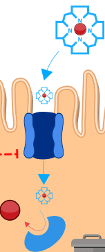

<!-- text only template -->

<!-- simulator with text  template -->

<button class="w3-right w3-button w3-theme" onclick="document.getElementById('legenda').style.display='block'">Zobraz legendu</button>

<button class="w3-button w3-theme w3-right" onclick="document.getElementById('legenda').style.display='none'"><i class="fa fa-close w3-large"></i></button>

|Schéma|Popis/funkce|
|---|---|
||__1. Příjem železa v potravě__ ve formě nehemové Fe2+, Fe3+ a hemové.|
||__2. Nehemové železo__  Fe2+ se vstřebává přes DMT1,  Fe 3+ se katalyzuje na Fe2+ pomocí Dcytb.|
| |__3. Hemové železo__ se přenáší do buňky, kde se pomocí HO uvolňuje Fe2+ |
| |__4. Ztráty__ železa vzniklé nevstřebáním|
| |__5.Pohotový pool, sdílená zásoba Fe2+__ která reguluje (inhibuje) transportér DMT1 a přenašeč hemu|
| |__6.Regulace příjmu a výdeje Fe2+ ve ferritinu__ |
| |__7.Genová regulace ferroportinu__ |

||Definice|Popis/funkce|
|---|---|---|
||Fe2+|Dvojmocné železo|
||Fe3+|Trojmocné železo|
||H+|Vodíkový iont|
||Hem|Porfyrinový kruh s centrálním atomem Fe2+|
||DMT1|Transportér divalentních kovů, symport Fe2+ a H+|
||Proteinový přenašeč hemu|Proteinový přenašeč hemu (neznámý), přenáší hem z luminální strany duodena do enterocytu.|
||Dcytb|Duodenální cytochrom b reduktáza: redukuje Fe3+ na Fe2+, elektrony dodává askorbát.|
||HO|Hemoxygenáza, uvolňuje Fe2+ z hemu za vzniku CO a biliverdinu|
||Ztráty železa|Ztráty železa vzniklé nevstřebáním nebo ztrátou buněk, které železo obsahují|
||Pool Fe2+|Pohotový pool Fe2+ železa v buňce, míra zaplnění odpovídá množství (zde 6/8)|
||Ferritin| Ferritin složený z a) proteinové části apoferitinu (oranžová) a b) iontů Fe3+. Funguje jako zásobárna Fe.|
||Transferin| Transferin|
||Hephesdin|Hephesdin|
||Ferroportin|Ferroportin|
||TfR1|Transferinový receptor 1|
|| STEAP3 | Metaloreduktáza |

