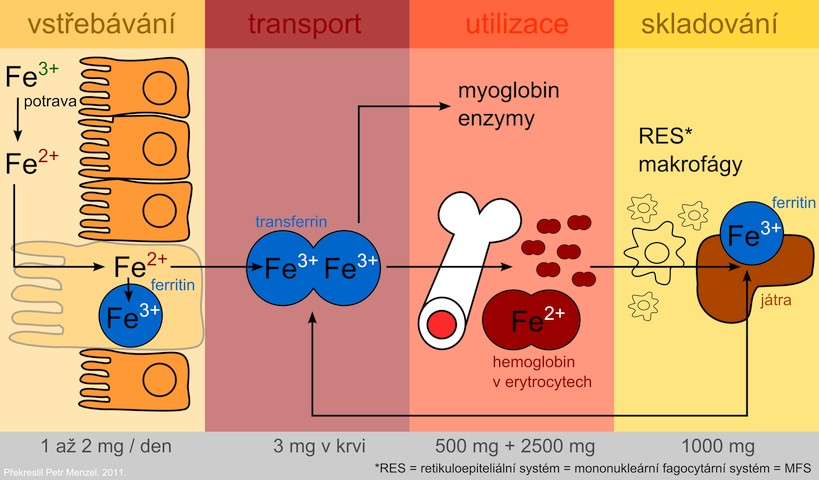

 __Obrázek__. Schéma zásob a skladování železa. zdroj https://www.wikiskripta.eu/index.php?curid=3196

*[cytochromů]: Cytochromy jsou skupinou proteinů s molekulou hemu. | Cytochromy jsou skupinou proteinů s molekulou hemu podobně jako hemoglobin. V medicíně jsou nejvíce důležité Cytochromy P450 podílející se jako katalyzátory metabolických reakcí. | https://www.wikiskripta.eu/w/Cytochrom_P450

*[prostetické skupiny]: Prostetická skupina je nebílkovinná část proteinů. | Prostetická skupina je nebílkovinná část proteinů, enzymů která umožňuje jeho katalytický účinek. Prostetická skupina je nejčastěji na enzym pevně vázána kovalentní vazbou. Enzym s navázanou prostetickou skupinou se nazývá holoenzym a má katalytickou funkci. Enzym tvořený pouze bílkovinnou složkou bez prostetické skupiny se nazývá apoenzym a nemá katalytickou funkci. | https://cs.wikipedia.org/wiki/Prostetick%C3%A1_skupina

*[epidermis]: Pokožka (epidermis) je nejsvrchnější vrstva kůže.  | Pokožka (epidermis) je nejsvrchnější vrstva kůže. Tvoří vodotěsný ochranný obal kolem povrchu těla a je tvořena jednak tenkým vrstevnatým epitelem z dlaždicovitých buněk a jednak pod nimi je bazální membrána. | https://cs.wikipedia.org/wiki/Poko%C5%BEka_(%C5%BEivo%C4%8Dichov%C3%A9)

*[deskvamací]: Deskvamace je olupování vnějších membrán buněk, např. kůže v drobných šupinkách nebo ve větších cárech. | Deskvamace, řidč. peeling je olupování vnějších membrán buněk, např. kůže v drobných šupinkách nebo ve větších cárech. K deskvamaci kůže dochází u zdravého jedince běžně, ale její projevy nejsou znatelné. | https://cs.wikipedia.org/wiki/Deskvamace

## Zásoby a ztráty

Celkové zásoby železa v organismu závisí téměř výhradně na jeho absorpci v trávícím traktu neboť __neexistuje regulovatelný způsob jeho exkrece z těla__. 

Ke ztrátám dochází především deskvamací buněk epidermis a buněk gastrointestinálních sliznic. K výrazným ztrátám dochází také při krvácení.

S výjimkou žen v období menstruace, které vyžadují o ~ 50% více dietárního železa, ztráty železa jsou minimální. 

<bdl-quiz 
question="Které z následujících fyziologických situací u zdravého jedince vede k největším ztrátám železa z organizmu" 
answers="Olupování kůže | Zánik a obnova buněk gastrointestinálního traktu | Krvácení při menstruaci"
correctoptions="false|false|true" 
buttontitle="zkontrolovat odpověď"
explanations="ne, ztráty z běžného olupování kůůže jsou minimální | ne. ztráty výměnou slizničních buněk z trávicího traktu jsou minimální | ano při jakémkoliv krvácení dochází k ztrátám erytrocytům, které jsou bohaté na železo obsahující hemoglobin"></bdl-quiz>

