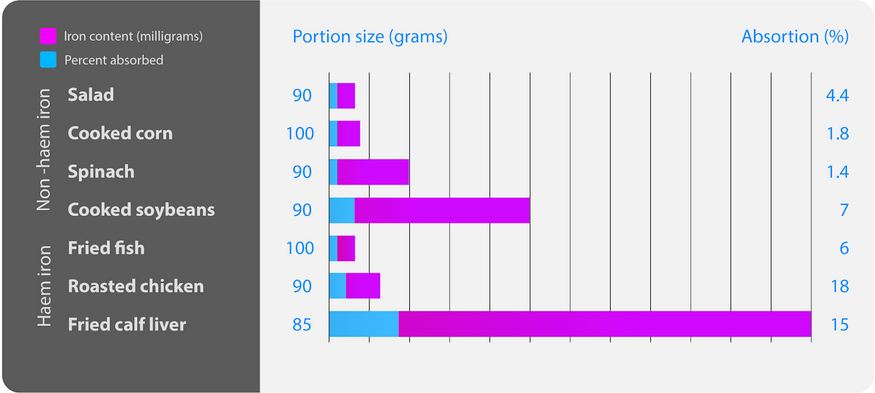

 __Obrázek FOOD__. Obsah hemového a nehemového železa ve vybraných potravinách a míra jeho absorpce v tenkém střevu.

Primárním zdrojem železa je maso, nejvíce pak červené maso a vnitřnosti, relativně vyšší podíl železa má i některá zelenina, např. sojové boby (Obrázek FOOD).

*[cytochromů]: Cytochromy jsou skupinou proteinů s molekulou hemu. | Cytochromy jsou skupinou proteinů s molekulou hemu podobně jako hemoglobin. V medicíně jsou nejvíce důležité Cytochromy P450 podílející se jako katalyzátory metabolických reakcí. | https://www.wikiskripta.eu/w/Cytochrom_P450

*[prostetické skupiny]: Prostetická skupina je nebílkovinná část proteinů. | Prostetická skupina je nebílkovinná část proteinů, enzymů která umožňuje jeho katalytický účinek. Prostetická skupina je nejčastěji na enzym pevně vázána kovalentní vazbou. Enzym s navázanou prostetickou skupinou se nazývá holoenzym a má katalytickou funkci. Enzym tvořený pouze bílkovinnou složkou bez prostetické skupiny se nazývá apoenzym a nemá katalytickou funkci. | https://cs.wikipedia.org/wiki/Prostetick%C3%A1_skupina

## Potrava a vstřebávání

Železo se v potravě nachází ve dvou formách: __hemové__ a __nehemové__.  Obě formy železa jsou vstřebávány odlišnými mechanismy. Hemové železo se obecně vstřebává efektivněji než nehemové. 

Celková absorpce železa je relativně nízká, vstřebá se až 20% železa obsaženého v potravě v závislosti na jejím charakteru (Obrázek FOOD). 
 
Doporučená denní dávka železa je ~ 10 mg/den u mužů a 15 mg/den u žen v reprodukčním období. Z tohoto množství se do organismu vstřebá přibližně 1-2 mg/den, nevyužitý zbytek odchází stolicí. 

<bdl-quiz 
question="Které z následujících porcí jídel je nejhodnotnější pro příjem železa." 
answers="Salát (90g)|Špenát (90g)|Pečené kuře (90g)"
correctoptions="false|false|true" 
buttontitle="zkontrolovat odpověď"
explanations="4.4% z 80mg tj. asi 4 mg se vstřebá| 1.4% z 200mg tj. asi 3 mg se vstřebá. Před 150 lety chyba mylně přiřkla 10x větší množství železa ve špenátu než v něm ve skutečnosti je.|18% z 110 mg tj. asi 18 mg se vstřebá"></bdl-quiz>

