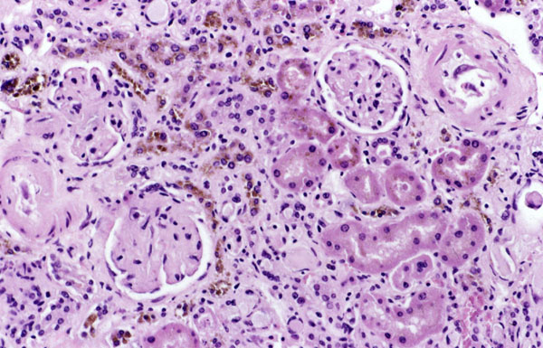

**Hemosiderin**, hnědé částice v mikroskopickém obraze buněk ledvin. zdroj https://en.wikipedia.org/wiki/Hemosiderin

## Hemosiderin

Druhou zásobní formou železa je **hemosiderin**, který vzniká agregací a postupnou degradací molekul ferritinu v lyzozomech při nadbytečném sycení cytozolu železem. Hemosiderin je ve srovnání s ferritinem větší, viditelný ve světelném mikroskopu (granulární pigment rezavě hnědé barvy) a jeho vazebná kapacita pro železo je rovněž vyšší. Železo se z hemosiderinu však uvolňuje obtížněji než z ferritinu.

<bdl-quiz type="match" question="Přiřaďte k proteinu jeho vlastnosti" terms="ferritin|hemosideron" answers="menší protein, pro buňku dobře dostupná zásoba železa|větší proteinový komplex, pro buňku ale hůře dostupná zásoba železa" ></bdl-quiz>

