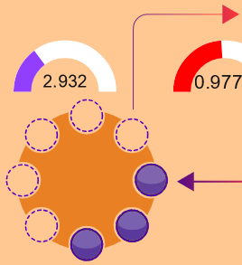
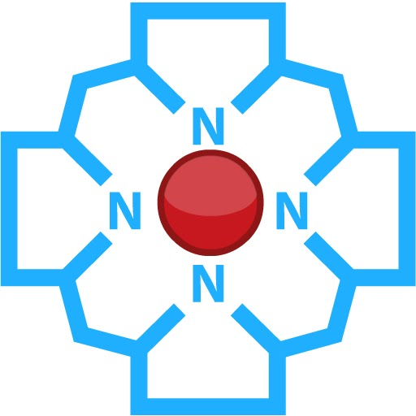

# 2.1 Simulace 
<button class="w3-right w3-button w3-theme" onclick="document.getElementById('legenda').style.display='block'">Zobraz legendu</button>
Regulace příjmu Fe a příjmu a výdeje Fe do/z ferritinu. Vyzkoušejte v simulátoru a zodpovězte otázky.

<bdl-fmi id="idfmi" src="FeMetabolism_FeMetabolismModel.js" fminame="FeMetabolism_FeMetabolismModel" tolerance="0.000001" starttime="0" fstepsize="0.1" guid="{ff6d8a55-f24a-4855-bbf0-86edcafe471e}" valuereferences="637534208,637534209,100663315,16777260,33554448,33554449,637534228,905969688,637534231,16777271,16777272" valuelabels="Fe_liv,Fe_spl,Fe_duo_intake,Fe_food,Fe_duo_2,Fe_duo_3,Fe_duo_in_food,Fe_duo_unused,Fe_duo_out_loss,to_ferritin_rate,from_ferritin_rate" inputs="id1,16777260,1,1;id2,16777271,1,1;id3,16777272,1,1" inputlabels="Fe_food,to_ferritin_rate,from_ferritin_rate" fpslimit="3"></bdl-fmi>

||| 
|-------------|-------|
| Koncentrace železa v potravě [$\frac{\mu g}{h}$] | <bdl-range id="id1" title="" min="0" max="1000" default="219" maxlength="5" step="1"></bdl-range> |
| Přítok železa do ferritinu v buňce | <bdl-range id="id2" title="" min="0" max="10" default="3" maxlength="5" step="0.1"></bdl-range>  |
| Odtok železa z ferritinu v buňce | <bdl-range id="id3" title="" min="0" max="10" default="0.3" maxlength="5" step="0.1"></bdl-range>  |

<bdl-animate-adobe src="DuodenumFinalObrazovka2.js" width="800" height="600" name="DuodenumFinalObrazovka2" fromid="idfmi"></bdl-animate-adobe>

<bdl-bind2a findex="3" aname="SipkaCervena1_anim" amin="0" amax="100" fmin="1" fmax="1000"></bdl-bind2a>
<bdl-bind2a findex="3" aname="Merak1_anim" amin="0" amax="99" fmin="0" fmax="1000"></bdl-bind2a>
<bdl-bind2a-text findex="3" aname="Hodnota1_text"></bdl-bind2a-text>

<bdl-bind2a findex="6" aname="SipkaCervena2_anim" amin="0" amax="100" fmin="0.91" fmax="2.74"></bdl-bind2a>
<bdl-bind2a findex="6" aname="SipkaZlutaH_anim" amin="0" amax="100" fmin="0.91" fmax="2.74"></bdl-bind2a>
<bdl-bind2a findex="6" aname="SipkaFialovaHorni_anim" amin="0" amax="100" fmin="0.91" fmax="2.74"></bdl-bind2a>
<bdl-bind2a findex="6" aname="SipkaModra_anim" amin="0" amax="100" fmin="0.91" fmax="2.74"></bdl-bind2a>
<bdl-bind2a findex="6" aname="SipkaModraModryKanalSpodni_anim" amin="0" amax="100" fmin="0.91" fmax="2.74"></bdl-bind2a>
<bdl-bind2a findex="6" aname="SipkaCervena3_anim" amin="0" amax="100" fmin="0.91" fmax="2.74"></bdl-bind2a>
<bdl-bind2a findex="6" aname="CervenaPoolIn_anim" amin="0" amax="100" fmin="0.91" fmax="2.74"></bdl-bind2a>

<bdl-bind2a findex="8" aname="CervenaKos_anim" amin="0" amax="100" fmin="0" fmax="0.5"></bdl-bind2a>
<bdl-bind2a-text findex="8" aname="Hodnota5_text"></bdl-bind2a-text>

<bdl-bind2a findex="7" aname="Merak2Cerveny_anim" amin="0" amax="99" fmin="0" fmax="16"></bdl-bind2a>
<bdl-bind2a findex="7" aname="SipkaSeda_anim" amin="0" amax="100" fmin="0" fmax="16"></bdl-bind2a>
<bdl-bind2a-text findex="7" aname="Hodnota2Cerveny_text"></bdl-bind2a-text>

<bdl-bind2a findex="4" aname="Fe2Skupina_anim" amin="100" amax="0" fmin="0.5" fmax="1.5"></bdl-bind2a>
<bdl-bind2a findex="4" aname="KanalCerveny_anim" amin="0" amax="99" fmin="0.5" fmax="1.5"></bdl-bind2a>
<bdl-bind2a findex="4" aname="KanalModry_anim" amin="0" amax="99" fmin="0.5" fmax="1.5"></bdl-bind2a>
<bdl-bind2a findex="4" aname="CervenaSrafovanaZastaveni1_anim" amin="99" amax="0" fmin="0.5" fmax="1.5"></bdl-bind2a>
<bdl-bind2a findex="4" aname="Merak4_anim" amin="0" amax="99" fmin="0.5" fmax="1.5"></bdl-bind2a>

<bdl-bind2a-text findex="4" aname="Hodnota4_text"></bdl-bind2a-text>

<bdl-bind2a findex="10" aname="SipkaCervenoFialova2_anim" amin="0" amax="100" fmin="0" fmax="10"></bdl-bind2a>
<bdl-bind2a findex="9" aname="SipkaCervenoFialova1_anim" amin="0" amax="100" fmin="0" fmax="10"></bdl-bind2a>
<bdl-bind2a findex="5" aname="Merak3_anim" amin="0" amax="100" fmin="0" fmax="10"></bdl-bind2a>
<bdl-bind2a-text findex="5" aname="Hodnota3_text"></bdl-bind2a-text>
<bdl-bind2a findex="5" aname="Fe3Skupina_anim" amin="0" amax="200" fmin="0" fmax="10"></bdl-bind2a>

## Kontrolní otázky

<bdl-quiz question="Jak se mění rovnováha mezi množstvím železa ve ferritinu (Fe3+) a v pohotovém poolu (Fe2+)?" answers="zvýšený Fe3+ svýší i koncentraci Fe2+|zvýšený Fe3+ sníží koncentraci Fe2+" correctoptions="true|false" explanations="|"></bdl-quiz>
<bdl-quiz question="Jak vypočítáme rovnovážnou konstantu?" answers="podíl koncentrací|součin koncentrací" correctoptions="true|false" explanations="Ano|Ne"></bdl-quiz>
<bdl-quiz question="Která rychlostní konstanta bude větší a jaký stav bude buňka preferovat? A proč?" answers="1. Přítok železa do ferritinu. |2. Odtok železa z ferritinu." correctoptions="true|false" explanations="vyšší koncentrace Fe2+ je pro buňku toxická. Buňka se snaží tedy ukládat železo do ferritinu|Odtok železa z ferritinu udržuje buňka nižší."></bdl-quiz>

<button class="w3-button w3-theme w3-right" onclick="document.getElementById('legenda').style.display='none'">Skryj legendu <i class="fa fa-close w3-large"></i></button>

## Vizualizace
Vizualizace simulátoru shrnuje schématicky předchozí fakta:

|Schéma|Popis/funkce|
|---|---|
||__1. Příjem železa v potravě__ ve formě nehemové Fe2+, Fe3+ a hemové.|
||__2. Nehemové železo__  Fe2+ se vstřebává přes DMT1,  Fe 3+ se katalyzuje na Fe2+ pomocí Dcytb.|
| |__3. Hemové železo__ se přenáší do buňky, kde se pomocí HO uvolňuje Fe2+ |
| |__4. Ztráty__ železa vzniklé nevstřebáním|
| |__5.Pohotový pool, sdílená zásoba Fe2+__ která reguluje (inhibuje) transportér DMT1 a přenašeč hemu|
| |__6.Regulace příjmu a výdeje Fe2+ ve ferritinu__

## Ikony
Schémata a vizualizace obsahují tyto ikony:

|Ikona|Definice|Popis/funkce|
|---|---|---|
||Fe2+|Dvojmocné železo|
||Fe3+|Trojmocné železo|
||H+|Vodíkový iont|
||Hem|Porfyrinový kruh s centrálním atomem Fe2+|
||DMT1|Transportér divalentních kovů, symport Fe2+ a H+|
||Proteinový přenašeč hemu|Proteinový přenašeč hemu (neznámý), přenáší hem z luminální strany duodena do enterocytu.|
||Dcytb|Duodenální cytochrom b reduktáza: redukuje Fe3+ na Fe2+, elektrony dodává askorbát.|
||HO|Hemoxygenáza, uvolňuje Fe2+ z hemu za vzniku CO a biliverdinu|
||Ztráty železa|Ztráty železa vzniklé nevstřebáním nebo ztrátou buněk, které železo obsahují|
||Pool Fe2+|Pohotový pool Fe2+ železa v buňce, míra zaplnění odpovídá množství (zde 6/8)|
||Ferritin| Ferritin složený z a) proteinové části apoferitinu (oranžová) a b) iontů Fe3+. Funguje jako zásobárna Fe.|

