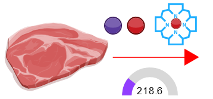

<bdl-animate-adobe src="DuodenumFinalObrazovka3.js" width="824" height="824" name="DuodenumFinalObrazovka3" fromid="idfmi" responsive="true"></bdl-animate-adobe>

<!--prijem-->
<bdl-bind2a findex="3" aname="children.0.SipkaCervena1_anim" amin="0" amax="159" fmin="0" fmax="1000"></bdl-bind2a>

<bdl-bind2a findex="3" aname="Merak1_anim" amin="0" amax="99" fmin="0" fmax="1000"></bdl-bind2a>
<bdl-bind2a-text findex="3" aname="Hodnota1_text" convertor="1,219"></bdl-bind2a-text>
<!--vstrebavani-->
<bdl-bind2a findex="6" aname="children.0.SipkaCervena2_anim" amin="0" amax="159" fmin="0.91" fmax="2.74"></bdl-bind2a>

<bdl-bind2a findex="6" aname="SipkaZlutaH_anim" amin="0" amax="159" fmin="0.91" fmax="2.74"></bdl-bind2a>
<bdl-bind2a findex="6" aname="children.0.SipkaZlutaH1_anim" amin="0" amax="159" fmin="0.91" fmax="2.74"></bdl-bind2a>
<bdl-bind2a findex="6" aname="SipkaFialovaHorni_anim" amin="0" amax="159" fmin="0.91" fmax="2.74"></bdl-bind2a>
<bdl-bind2a findex="6" aname="SipkaModra_anim" amin="0" amax="159" fmin="0.91" fmax="2.74"></bdl-bind2a>
<bdl-bind2a findex="6" aname="SipkaModraModryKanalSpodni_anim" amin="0" amax="159" fmin="0.91" fmax="2.74"></bdl-bind2a>
<bdl-bind2a findex="6" aname="SipkaCervena3_anim" amin="0" amax="159" fmin="0.91" fmax="2.74"></bdl-bind2a>
<bdl-bind2a findex="6" aname="CervenaPoolIn_anim" amin="0" amax="159" fmin="0.91" fmax="2.74"></bdl-bind2a>
<bdl-bind2a findex="6" aname="Hemox_anim" amin="0" amax="159" fmin="0.91" fmax="2.74"></bdl-bind2a>
<bdl-bind2a findex="6" aname="DcytB_anim" amin="0" amax="159" fmin="0.91" fmax="2.74"></bdl-bind2a>
<!--ztraty v bunce -->
<bdl-bind2a findex="8" aname="CervenaKos_anim" amin="0" amax="159" fmin="0.1" fmax="0.4"></bdl-bind2a>
<bdl-bind2a-text findex="8" aname="Hodnota5_text" convertor="10,2.73"></bdl-bind2a-text>
<bdl-bind2a findex="8" aname="children.0.Merak5_anim" amin="0" amax="99" fmin="0.1" fmax="0.4"></bdl-bind2a>

<!-- nevyuzito -->
<bdl-bind2a findex="7" aname="Merak2Cerveny_anim" amin="0" amax="99" fmin="0" fmax="16"></bdl-bind2a>
<bdl-bind2a findex="7" aname="SipkaSeda_anim" amin="0" amax="100" fmin="0" fmax="16"></bdl-bind2a>
<bdl-bind2a-text findex="7" aname="Hodnota2Cerveny_text" convertor="1,3.612"></bdl-bind2a-text>

<!-- tok Fe2+ do bunky -->
<bdl-bind2a findex="4" aname="Fe2Skupina_anim" amin="100" amax="0" fmin="0.5" fmax="1.5"></bdl-bind2a>
<bdl-bind2a findex="4" aname="children.0.KanalCerveny_anim" amin="0" amax="99" fmin="0.64" fmax="0.88"></bdl-bind2a>

<bdl-bind2a findex="4" aname="children.0.KanalModry_anim" amin="0" amax="99" fmin="0.64" fmax="0.88"></bdl-bind2a>

<bdl-bind2a findex="4" aname="children.0.CervenaSrafovanaZastaveni1_anim" amin="159" amax="0" fmin="0.5" fmax="1.5"></bdl-bind2a>
<bdl-bind2a findex="4" aname="children.0.CervenaSrafovanaZastaveni2_anim" amin="159" amax="0" fmin="0.5" fmax="1.5"></bdl-bind2a>

<bdl-bind2a findex="4" aname="Merak4_anim" amin="0" amax="99" fmin="0.5" fmax="1.5"></bdl-bind2a>

<bdl-bind2a-text findex="4" aname="Hodnota4_text" convertor="1,0.7428"></bdl-bind2a-text>
<!-- feritin -->
<bdl-bind2a findex="10" aname="SipkaCervenoFialova2_anim" amin="0" amax="159" fmin="0" fmax="10"></bdl-bind2a>
<bdl-bind2a findex="9" aname="SipkaCervenoFialova1_anim" amin="0" amax="159" fmin="0" fmax="10"></bdl-bind2a>
<bdl-bind2a findex="5" aname="Merak3_anim" amin="0" amax="99" fmin="0.8" fmax="3.5"></bdl-bind2a>
<bdl-bind2a-text findex="5" aname="Hodnota3_text" convertor="1,2.2"></bdl-bind2a-text>
<bdl-bind2a findex="5" aname="children.0.Fe3Skupina_anim" amin="0" amax="159" fmin="0.8" fmax="3.5"></bdl-bind2a>

<!-- ferroportin -->

<bdl-bind2a findex="14" aname="children.0.SipkaRuzova2_anim" amin="0" amax="159" fmin="0.002" fmax="2"></bdl-bind2a>

<bdl-bind2a findex="13" aname="SipkaFialovaSrafovana_anim" amin="0" amax="159" fmin="0.02" fmax="0.07"></bdl-bind2a>

<bdl-bind2a findex="16" aname="SipkaFialovaSpodni3_anim" amin="0" amax="159" fmin="1.5" fmax="3.0"></bdl-bind2a>
<bdl-bind2a findex="16" aname="CervenaVSipkaVehicle1_anim" amin="0" amax="159" fmin="1.5" fmax="3.0"></bdl-bind2a>
<bdl-bind2a findex="16" aname="children.0.SipkaCervenaSpodni_anim" amin="0" amax="159" fmin="1.5" fmax="3.0"></bdl-bind2a>
<bdl-bind2a findex="16" aname="children.0.Hep_anim" amin="0" amax="159" fmin="1.5" fmax="3.0"></bdl-bind2a>

<bdl-bind2a findex="15" aname="KanalFialovy_anim" amin="99" amax="0" fmin="0.03" fmax="1.3"></bdl-bind2a>
<bdl-bind2a findex="11" aname="Semafor_anim" amin="4" amax="5" fmin="0" fmax="1"></bdl-bind2a>
<bdl-bind2a-text findex="13" aname="Hodnota6_text" convertor="1,0.0412"></bdl-bind2a-text>
<bdl-bind2a findex="18" aname="children.587.FeTransferin_anim" amin="0" amax="200" fmin="0.2" fmax="3"></bdl-bind2a>

<bdl-bind2a-text findex="18" aname="Hodnota9_text" convertor="1,1.51"></bdl-bind2a-text>
<bdl-bind2a findex="18" aname="children.0.Merak9_anim" amin="0" amax="99" fmin="0.2" fmax="3"></bdl-bind2a>

<bdl-bind2a findex="13" aname="children.0.Merak6_anim" amin="0" amax="99" fmin="0.01" fmax="0.07"></bdl-bind2a>

<button class="w3-right w3-button w3-theme" onclick="document.getElementById('legenda').style.display='block'">Zobraz legendu</button>

<bdl-fmi id="idfmi" src="FeMetabolism_FeMetabolismModel.js" fminame="FeMetabolism_FeMetabolismModel" tolerance="0.000001" starttime="0" fstepsize="0.1" guid="{ff6d8a55-f24a-4855-bbf0-86edcafe471e}" valuereferences="637534208,637534209,100663315,16777260,33554448,33554449,637534228,905969688,637534231,16777271,16777272,16777267,637534233,637534237,33554439,33554443,637534230,637534257,33554447" valuelabels="Fe_liv,Fe_spl,Fe_duo_intake,Fe_food,Fe_duo_2,Fe_duo_3,Fe_duo_in_food,Fe_duo_unused,Fe_duo_out_loss,to_ferritin_rate,from_ferritin_rate,Fpn_duo_knockout,Fpn_duo_in_1,Fpn_duo_in,Fpn_duo_mRNA,Fpn_duo,Fe_duo_out_ser,Fe_ser_in_duo,Fe_ser" inputs="id1,16777260,1,1;id4,16777267,1,1" inputlabels="Fe_food,Fpn_duo_knockout" showtime="1" showtimemultiply="3600"></bdl-fmi>

Regulace příjmu Fe a ukládání do ferritinu a výdeje z enterocytu. Vyzkoušejte v simulátoru a zodpovězte otázky. Simulace (1s &asymp; 1h).
||| 
|-------------|-------|
| Koncentrace železa v potravě | <bdl-range id="id1" title="" min="0" max="1000" default="219" step="1"></bdl-range> $\frac{\mu g}{h}$  |
| Knockout genu pro ferroportin(Fpn) | <bdl-checkbox id="id4" titlemin="gen Fpn je knockoutován (neaktivní)" titlemax="gen Fpn je aktivní" default="true"></bdl-checkbox>  |

* Vyzkoušejte si, jak reaguje počet Fpn transportérů (míra otevření) na množství železa v buňce.
* Vyzkoušejte si hypotetický genový knockout pro Fpn.
* Sledujte vývoj saturace transferinu (~ množství železa v séru) se změnou příjmu železa v potravě

<bdl-quiz question="Co má za následek genový knockout Fpn? Jak se změní koncentrace železa v enterocytu a v séru?" answers="Počet ferroportinu v membráně se sníží. Železo se hromadí v enterocytu a jeho množství v séru klesá|Počet ferroportinu se v membraně zvýší. Železo se transportuje z enterocytu do krve" correctoptions="true|false" explanations="správná odpověď na tuto otázku|nesprávná odpověď. Toto se děje pokud je gen aktivní."  buttontitle="zkontrolovat odpověď"></bdl-quiz>

<button class="w3-button w3-theme w3-right" onclick="document.getElementById('legenda').style.display='none'"><i class="fa fa-close w3-large"></i></button>

|Schéma|Popis/funkce|
|---|---|
||__1. Příjem železa v potravě__ ve formě nehemové Fe2+, Fe3+ a hemové.|
||__2. Nehemové železo__  Fe2+ se vstřebává přes DMT1,  Fe 3+ se katalyzuje na Fe2+ pomocí Dcytb.|
| |__3. Hemové železo__ se přenáší do buňky, kde se pomocí HO uvolňuje Fe2+ |
| |__4. Ztráty__ železa vzniklé nevstřebáním|
| |__5.Pohotový pool, sdílená zásoba Fe2+__ která reguluje (inhibuje) transportér DMT1 a přenašeč hemu|
| |__6.Regulace příjmu a výdeje Fe2+ ve ferritinu__ |
| |__7.Genová regulace ferroportinu__ |

|Ikona|Definice|Popis/funkce|
|---|---|---|
||Fe2+|Dvojmocné železo|
||Fe3+|Trojmocné železo|
||H+|Vodíkový iont|
||Hem|Porfyrinový kruh s centrálním atomem Fe2+|
||DMT1|Transportér divalentních kovů, symport Fe2+ a H+|
||Proteinový přenašeč hemu|Proteinový přenašeč hemu (neznámý), přenáší hem z luminální strany duodena do enterocytu.|
||Dcytb|Duodenální cytochrom b reduktáza: redukuje Fe3+ na Fe2+, elektrony dodává askorbát.|
||HO|Hemoxygenáza, uvolňuje Fe2+ z hemu za vzniku CO a biliverdinu|
||Ztráty železa|Ztráty železa vzniklé nevstřebáním nebo ztrátou buněk, které železo obsahují|
||Pool Fe2+|Pohotový pool Fe2+ železa v buňce, míra zaplnění odpovídá množství (zde 6/8)|
||Ferritin| Ferritin složený z a) proteinové části apoferitinu (oranžová) a b) iontů Fe3+. Funguje jako zásobárna Fe.|

