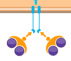

<b>A.</b>
<bdl-pdb-pdbe-molstar molecule-id="3s9l" height="500px"></bdl-pdb-pdbe-molstar>

**B:**  
**C:** 

**Obrázek TfR1**. **A** interaktivní 3D obrázek komplexu
proteinu TfR1 (transferrin receptor, oranžový a zelený) s navázanými 2 transferriny (červený a fialový).
**B** ikona transferrin receptoru
**C** schéma transferrin receptoru s navazujícím se transferrinem na membráně enterocytu.

Aby mohl transferin dopravit železité ionty na místo určení, musí daná buňka disponovat na svém povrchu příslušným receptorem - transferinový receptor 1 (TfR1, Obrázek TfR1). TfR1 receptor je hojně exprimován na všech buňkách organismu, nejvíce však na erytroblastech, které vyžadují vysoký příjem železa pro svůj vývoj. TfR1 má vysokou afinitu k transferinu s navázaným železem. Existuje i jeho homologní varianta, transferinový receptor 2 (TfR2), který slouží jako senzor hladiny na transferin vázaného železa v plazmě. Exprese nízko-afinitního TfR2 je výrazně nižší a je omezena pouze na specializované tkáně jako například hepatocyty nebo erytroblasty. TfR1 je transportní glykoprotein, který zajišťuje přenos železa do buňky a jeho množství v membráně je regulováno na základě potřeby, tj. aktuálního stavu koncentrace železa v buňce.

