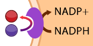
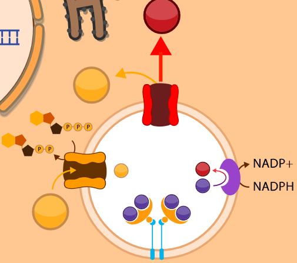

<bdl-pdb-pdbe-molstar id="pdb2h35" molecule-id="2vns" hide-controls="true" height="500px"></bdl-pdb-pdbe-molstar>

**Obrázek STEAP3** **A** molekulární 3D struktura metaloreduktázy STEAP 3.

<b style="vertical-align:middle;">B.</b>
<b style="vertical-align:middle;">C.</b>
<b style="vertical-align:top;">D.</b>

**B.** ikona pro metaloreduktázu v dalším simulátoru a
**C.** schéma redukce Fe3+ na Fe2+ metaloreduktázou na membráně endocytotického váčku.
**D.** schéma endocytotického váčku.

Import železa do buňky je zajištěn receptorově-mediovanou endocytózou (vzniká tzv. “clathrin coated pit”) následně po vytvoření komplexu (holoTf)2-TfR1. V membráně endocytického váčku se nachází:

* TfR1 s dvěma navázanými holoTf (tj. 4 ionty Fe3+)
* H+-ATPáza
* STEAP3 metaloreduktáza (Obrázek STEAP3)
* DMT1

H+-ATPáza využívá energie ATP k přenosu protonů do endocytotického váčku, ve kterém tak klesá pH až na hodnoty ~ 5.5. Kyselé prostředí vede k oslabení interakce mezi Tf a železitými ionty, které se uvolňují. Transmembránová metaloreduktáza STEAP3 (Obrázek STEAP3) redukuje Fe3+ na Fe2+, potřebné elektrony dodává z vnější strany NADPH + H+. Dvojmocné železo je pak pomocí DMT1 symportním mechanismem přeneseno společně s protonem do nitra buňky, energií pro přenos zajišťuje elektrochemický gradient protonů. Proces redukce a následného symportu je tedy analogický přenosu železa ze střeva do enterocytu.

