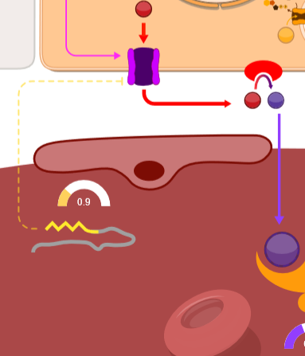

**A.** Schématické znázornění hepcidinu. **B.** Role hepcidinu - snížení koncentrace ferroportinových exportérů a tím inhibice exportu železa z buňky do plazmy.

Mechanismus účinku hepcidinu spočívá ve snížení koncentrace feroportinových exportérů. 
Po navázání hepcidinu na feroportin dojde ke změně konformace feroportinu a následně jeho internalizaci do buňky, kde je degradován v lysosomech. 
Efektivně je tak snížen tok železa z buňky do plazmy, kde klesá saturace transferinu. 

Funkce hepcidinu tak spočívá v redistribuci železa v organismu tak, že klesá koncentrace pro tělo dostupného železa v plazmě a naopak stoupá obsah depotního železa v buňkách, především v enterocytech, hepatocytech a buňkách monocyto-makrofágového systému.

