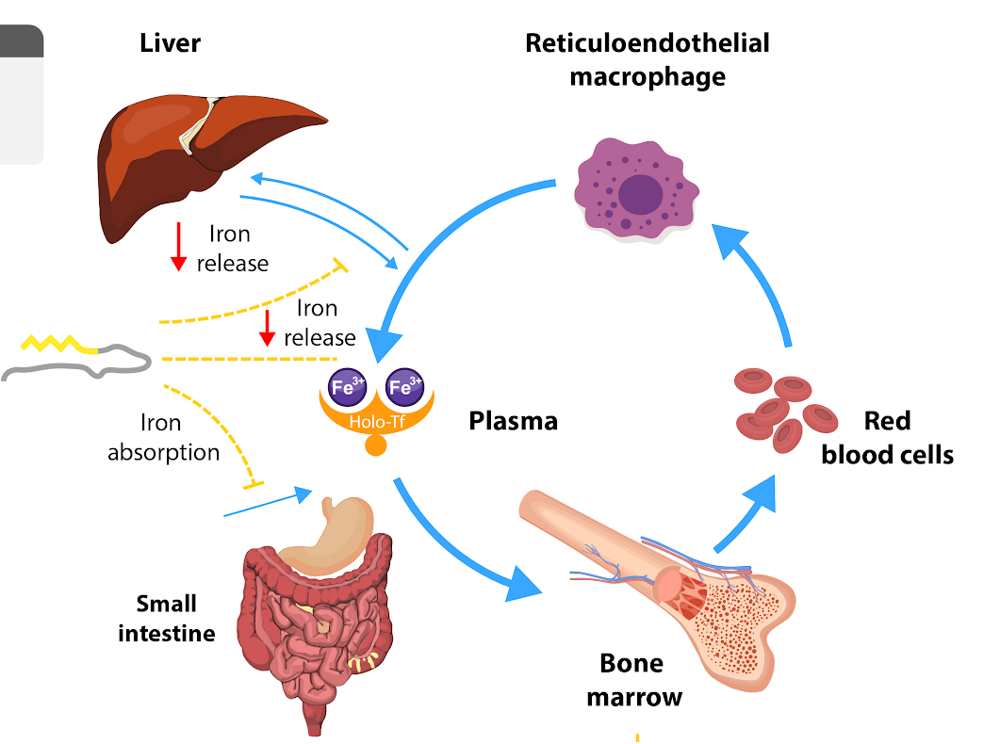

**Obrázek Role HEPCIDINU.** Schématické znázornění role hepcidinu v udržování homeostázy železa - inhibice exportu železa z některých buněk. 

## Fyziologie a patofyziologie hepcidinu

Role hepcidinu spočívá v udržování homeostázy železa a to prostřednictvím inhibice exportu železa z některých buněk. 

Porucha regulace: chronický nedostatek hepcidinu způsobí přetížení organismu železem a jeho ukládání v játrech a ostatním parenchymu, kde způsobuje fibrotizaci. Více viz kapitola [1.8.2 Nadbytek železa](#iron72.md)

Porucha regulace - chronické zvýšení hladiny hepcidinu vede k sideropenické anémii. Více viz kapitola [1.8. Nedostatek železa](#iron7.md)

<bdl-quiz question="Přiřaďte:"
	  type="match"
	  terms="fyziologicky normální role hepcidinu | chronický nedostatek hepcidinu | chronický nadbytek hepcidinu"
	  answers="inhibice exportu železa z některých buněk | zvýšený příjem a export železa, přetížení organismu železem | snížený příjem a export železa, vedoucí k tzv. sideroponické anémii">
</bdl-quiz>

