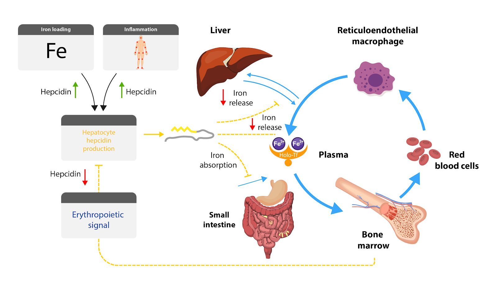

**Obrázek Role HEPCIDINU.** Schématické znázornění role hepcidinu v udržování homeostázy železa. Hepcidin je regulován primárně třemi nezávislými mechanismy: 1) aktuální hladina železa - zvyšuje hladinu hepcidinu, 2) aseptický nebo infekční zánět - zvyšuje hladinu hepcidinu, 3) erytropoetická aktivita - snižuje hladinu hepcidinu.

Exprese hepcidinu je homeostaticky regulovaná minimálně třemi nezávislými mechanismy (Obrázek HEPCIDIN):

1. Hladinou železa
2. Zánětem
3. Erytropoetickou aktivitou

ad 1) Zvýšená hladina depotního železa vázaného na ferritin i plazmatického železa vázaného na transferrin stimuluje produkci hepcidinu. V reakci na to klesá koncentrace ferroportinu a stoupá objem železa uvnitř enterocytů. Zpětnou vazbou se tak tlumí další přívod železa z potravy internalizací příslušných přenašečů železa na apikální membráně. Naopak při nedostatku železa je syntéza hepcidinu suprimována, čímž se zvýší příjem železa v duodenu a jeho export do krve. Pozitivní korelace mezi hladinou železa a hepcidinu se tak snaží zajistit stabilní plazmatickou koncentraci železa. 

ad 2) Syntéza hepcidinu je dramaticky stimulována v případě zánětu nebo infekce mechanismy, které jsou nezávislé na aktuální koncentraci železa nebo na erytropoetické aktivitě. Role zánětu na homeostázu železa popsána v následující sekci.

