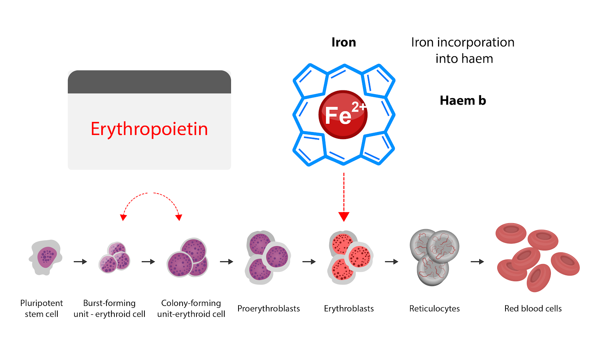

# 5.3 Erytropoietin a hepcidin
ad 3) Zvýšená erytropoetická aktivita je silným supresorem syntézy hepcidinu, neboť silnější produkce erytrocytů je spojena se zvýšenou poptávkou po transferinovém železe (Obrázek ERYTROPOETIN). Bylo prokázáno, že jedna injekce rekombinantního erytropoetinu během 24h dramaticky sníží hladinu hepcidinu. Ukazuje se však, že samotný erytropoetin není přímým regulátorem exprese hepcidinu. Souvisejícím negativním regulátorem syntézy hepcidinu je také hypoxie. Přesný mechanismus není znám a existuje hypotéza, že její vliv na hladinu hepcidinu je nepřímý a to prostřednictvím zvýšené proliferace erytrocytární řady v reakci na vyplavený erytropoetin.

**Obrázek ERYTHROPOIETIN** Schématické znázornění proliferace erytrocytární řady s vyznačením stupňů působení EPO. Dostupnost železa pro jeho inkorporaci do hemové formy je klíčová především v erytroblastickém fázi vyzrávání. 