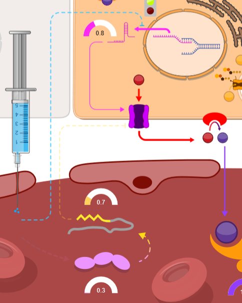
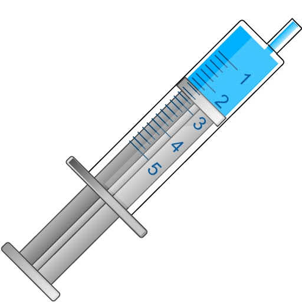

**A.** 

## Zánětlivá reakce 2

Zánětlivou reakci můžeme experimentálně navodit injekcí endotoxinu ze stěny gramnegativních bakterií, lipopolysacharidu (LPS). LPS působí jako pyrogen a stimuluje mononukleární fagocyty k produkci endogenních prozánětlivých cytokinů (IL-1, IL-6, TNF). LPS také aktivuje alternativní dráhou komplementový systém a při vyšších koncentracích LPS může dojít až k septickému šoku. Experimentálně je možné ukázat, že injekce LPS vede k rychlému a přechodnému poklesu hladiny sérového železa, který je doprovázen zvýšenou akumulaci železa v játrech a v makrofágovém systému sleziny. Mechanismus působení LPS na metabolismus železa souvisí se snížení koncentrace Fpn. Na základě experimentálních dat je jeví, že existují dvě na sobě nezávislé cesty k redukci koncentrace Fpn. První, hepcidin-dependentní post-transkripční mechanismus, souvisí s internalizací Fpn přímým působením hepcidinu, jehož syntéza v játrech je ko-stimulována IL-6 v reakci na infekční zánět (viz. hepatocyt). Druhá experimentálně pozorovaná cesta, nezávislá na hepcidinu, souvisí s útlumem exprese Fpn mRNA a snižuje tak samotný vznik Fpn.

&nbsp;&nbsp;&nbsp;<b style="vertical-align:top;">B.</b>
&nbsp;&nbsp;&nbsp;<b style="vertical-align:top;">C.</b> 

**A.** schéma účinku LPS na FPN a na IL-6 a hepcidin. **B.** Schématické znázornění IL-6 v dalších simulátorech. **C** Ikona pro injekci <b>Lipopolysacharidu (LPS)</b> Endotoxin z bakteriální stěny vyvolávající zánětlivou odpověď.

