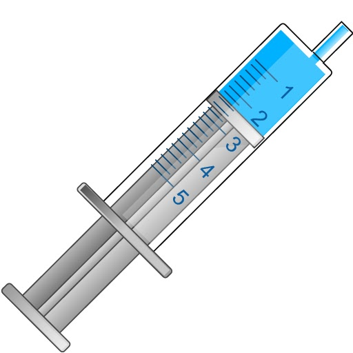

<bdl-pdb-pdbe-molstar id="pdb2il6" molecule-id="2il6" hide-controls="true" height="500px"></bdl-pdb-pdbe-molstar>
Obrázek **A**: Molekulární struktura prozánětlivého interleukinu 6 (IL-6)

&nbsp;&nbsp;&nbsp;<b style="vertical-align:top;">B.</b>
&nbsp;&nbsp;&nbsp;<b style="vertical-align:top;">C.</b> 

**B.** Schématické znázornění IL-6 v dalších simulátorech. **C** Ikona pro injekci <b>Lipopolysacharidu (LPS)</b> Endotoxin z bakteriální stěny vyvolávající zánětlivou odpověď.

 
 
 

## Zánětlivá reakce 
Už v 60. letech minulého století popsal Finch fylogeneticky velmi starou obrannou reakci zadržení železa při napadení organismu nepřítelem, například mikroby. Smyslem této evolučně konzervované reakce je zamezit mikrobům přístup k železu, které by ho mohly využít jako růstový faktor. Analogicky jako k nepřátelskému organismu přistupuje tělo k nádorové buňce a snaží se jí zabránit přístupu k železu, které je nezbytné pro metabolické pochody. Zatímco u primitivních organismů je deplece železa zajištěna vazbou na vhodný bílkovinný nosič, u vyšší organismů je železo deponováno do specializovaných buněk, makrofágů. Finchem objevená obranná reakce těla je způsobena hepcidinem, resp. zvýšením jeho produkce při akutním zánětu. Podobnou reakci nicméně tělo vyvolá i při chronických zánětlivých procesech autoimunitního původu v rámci systémových chorob nebo v případě onkologických onemocnění. Zvýšená syntéza hepcidinu v uvedených patologických stavech je zprostředkována především interleukinem 6 (IL-6) a tumor nekrotizujícím faktorem (TNF), cytokiny produkovanými při při zánětech a maligních nádorech. Bližší popis mechanismu zvýšení exprese hepcidinu v reakci na IL-6 je uveden v sekci pro hepatocyt.

Zánětlivou reakci můžeme experimentálně navodit injekcí endotoxinu ze stěny gramnegativních bakterií, lipopolysacharidu (LPS). LPS působí jako pyrogen a stimuluje mononukleární fagocyty k produkci endogenních prozánětlivých cytokinů (IL-1, IL-6, TNF). LPS také aktivuje alternativní dráhou komplementový systém a při vyšších koncentracích LPS může dojít až k septickému šoku. Experimentálně je možné ukázat, že injekce LPS vede k rychlému a přechodnému poklesu hladiny sérového železa, který je doprovázen zvýšenou akumulaci železa v játrech a v makrofágovém systému sleziny. Mechanismus působení LPS na metabolismus železa souvisí se snížení koncentrace Fpn. Na základě experimentálních dat je jeví, že existují dvě na sobě nezávislé cesty k redukci koncentrace Fpn. První, hepcidin-dependentní post-transkripční mechanismus, souvisí s internalizací Fpn přímým působením hepcidinu, jehož syntéza v játrech je ko-stimulována IL-6 v reakci na infekční zánět (viz. hepatocyt). Druhá experimentálně pozorovaná cesta, nezávislá na hepcidinu, souvisí s útlumem exprese Fpn mRNA a snižuje tak samotný vznik Fpn.

