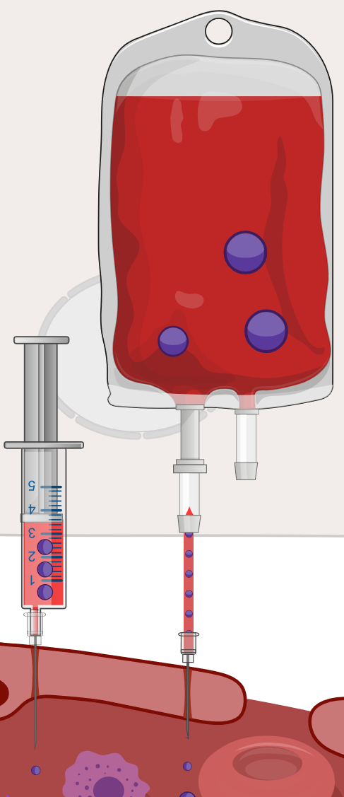

**Obrázek:** schéma ztráty krve jako umělého odběru krve pomocí stříkačky a příjem krve pomocí krevního vaku.

# Ztráty a příjem krve

V posledním modulu je možné simulovat reakci organismu na kontinuální odběr nebo transfúzi krve. Je potřeba si uvědomit, že ztráta a příjem krve jsou neodlučitelně spojeny s přesunem železa z/do organismu a s tím souvisí i patologické stavy plynoucí z nedostatku, resp. nadbytku železa.

## Ztráty krve
Dlouhodobý nedostatek železa vede k nejčastějšímu typu anémie - sideropenické anémii - a to z důvodu nedostatečné syntézy hemoglobinu (mikrocytární anémie). Ztráty železa (nejčastěji prostřednictvím ztrát krve), které v modelu simulujeme kontinuálním odběrem krve regulovatelnou rychlostí, mohou nastat z různých příčin které se liší v závislosti na věkové skupině. U novorozenců je nedostatek železa primárně způsoben nedostatečnou koncentrací železa v mateřském mléce, u dětí je za karencí železa nejčastěji nevhodná dieta. U dospělých žen v reprodukčním věku stojí za nedostatkem železa menoragie nebo těhotenství, u mužů je to krvácení z gastroduodenálních vředů. U seniorů je to pak chronické zánětlivé nebo onkologické onemocnění, v případě zemí třetího světa pak i možná infestace různými parazity (ankylostoma duodenale, necator americanus, apod.). Mezi další příčiny nedostatku železa patří malnutrice, malabsorpce nebo gastrektomie. Při negativní bilanci železa dochází nejprve k vyčerpání zásob železa, což se laboratorně projeví sníženou hladinou feritinu a zvýšenou hodnotou TIBC (total iron binding capacity). Pokud karence železa progreduje, dochází v dalším kroku ke snížení sérové hladiny železa a snížení saturace transferinu. Postupně nastupuje manifestní normocytární anémie, kdy jsou v kostní dřeni tvořeny morfologicky normální erytrocyty, ale v menším množství. V dalším stupni pak normocytární anémie přechází v mikrocytární hypochromní anémii. V sérů můžeme rovněž detekovat zvýšenou hladinu volného erytrocytárního protoporfyrinu (FEP). Klinicky můžeme pozorovat Plummer-Vinsonův syndrom, který se projevuje atrofickou glositidou, dysfágií a ezofageálními protruzemi, které mohou obturovat pasáž tráveniny.

