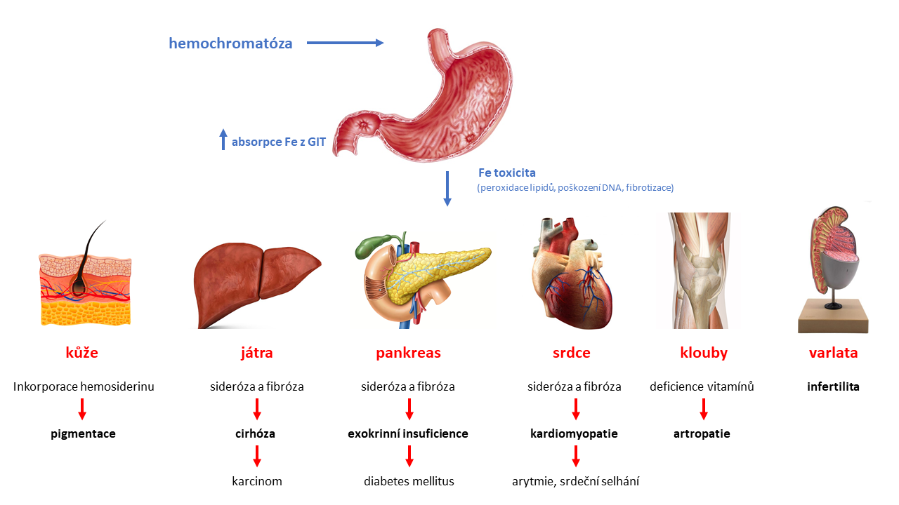

*[RES]: reticuloendothelial system
*[HFE]: High FE 2 gene for human homeostatic iron protein 
*[GIT]: gastrointestinal tract 

**Obrázek HEMOCHROMATÓZA** schéma vlivu hemochromatózy na různé tkáně

### Hemochromatóza (hereditární hemochromatóza)

U hemochromatózy rovněž dochází k masivní systémové akumulaci hemosiderinu, zdroj železa v tomto případě však není na rozdíl od hemosiderózy z rozpadlých erytrocytů, ale vzniká vrozenou poruchou regulace vstřebávání železa v duodenální sliznici. Onemocnění je nejčastěji asociované s mutacemi genů zahrnutých v regulaci hepcidinu (nejčastěji se jedná o mutaci genu HFE) nebo v samotném hepcidinu. Výsledkem všech příčinných genetických poruch je kontinuálně vysoká absorpce železa z GIT a to bez ohledu na stav zásob železa v organismu. Důsledkem poruchy je pak zvýšené ukládání železa ve tkáních (Obrázek HEMOCHROMATÓZA).

