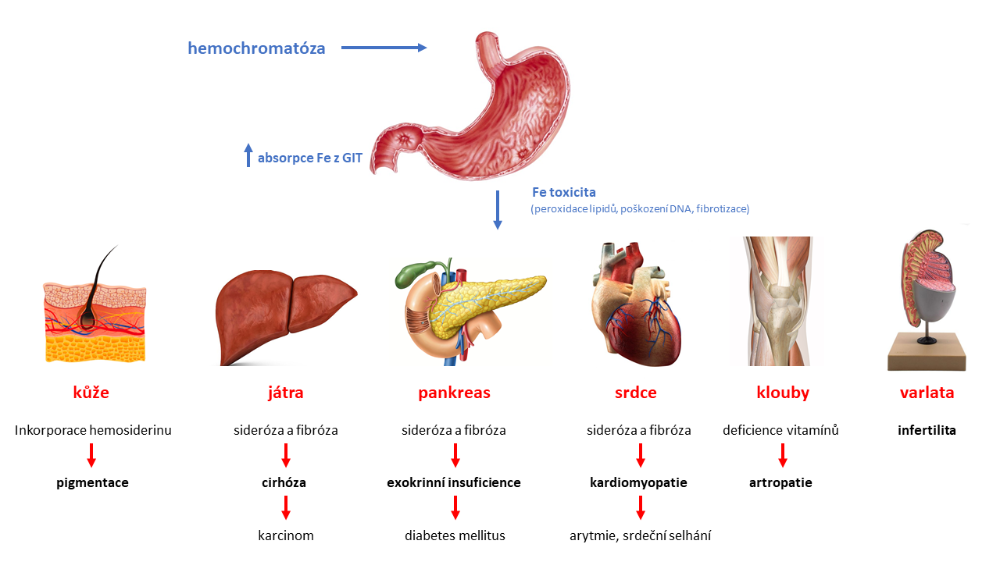

*[RES]: reticuloendothelial system
*[HFE]: High FE 2 gene for human homeostatic iron protein 
*{GIT]: gastrointestinal tract 

**Obrázek HEMOCHROMATÓZA** schéma vlivu hemochromatózy na různé tkáně

## Příjem (transfúze) krve
    
Nadbytek železa v organismu vede k jiným patologickým stavům. Obecný mechanismus souvisí s nadměrnou depozicí železa v tkáních. Excesivní a dlouhodobá přítomnost iontů železa ve formě hemosiderinu je pro tkáň toxická. Železo katalyzuje tvorbu hydroxylových radikálů (viz. výše), což jednak způsobuje poškozování parenchymatózních buněk, jednak indukuje intersticiální fibrotizaci v orgánech, která v játrech může vyústit do jaterní cirhózy. Nadměrné množství hemosiderinu může vést i k poškozování DNA a ke zvýšenému riziku maligní transformace. Pro ilustraci uveďme dva příklady poškození:

### Systémová hemosideróza

K systémové akumulaci hemosiderinu (především v orgánech RES, tj. slezina, játra, kostní dřeň) dochází v důsledku chronické hemolýzy při hemolytických anémiích, po opakovaných krevních transfuzích z různých důvodů, ale také při parenterálním podávání přípravků obsahujících železo. Postižené orgány jsou rezavě pigmentované, hemosiderin je deponován primárně ve tkáňových makrofázích (játra).

### Hemochromatóza (hereditární hemochromatóza)

U hemochromatózy rovněž dochází k masivní systémové akumulaci hemosiderinu, zdroj železa v tomto případě však není na rozdíl od hemosiderózy z rozpadlých erytrocytů, ale vzniká vrozenou poruchou regulace vstřebávání železa v duodenální sliznici. Onemocnění je nejčastěji asociované s mutacemi genů zahrnutých v regulaci hepcidinu (nejčastěji se jedná o mutaci genu HFE) nebo v samotném hepcidinu. Výsledkem všech příčinných genetických poruch je kontinuálně vysoká absorpce železa z GIT a to bez ohledu na stav zásob železa v organismu. Důsledkem poruchy je pak zvýšené ukládání železa ve tkáních (Obrázek HEMOCHROMATÓZA).

