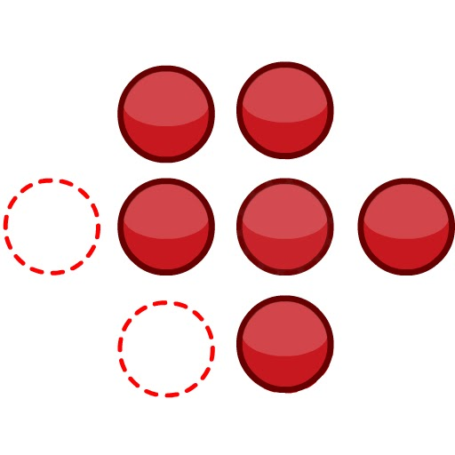

## Simulátor celku
<button class="w3-right w3-button w3-theme" onclick="document.getElementById('legenda').style.display='block'">Zobraz legendu</button>
Simulátor spusťte/zastavte tlačítky níže a zkuste zodpovědět otázky. Během simulace můžete měnit **parametr**: koncentrace železa v potravě, tj. kolik mikrogramů železa se vstřebá za hodinu. Tlačítkem vpravo zobrazíte legendu. 

<bdl-animate-adobe src="ZelezoCelekFinal2019_2.js" width="800" height="600" name="ZelezoCelekFinal2019_2" fromid="idfmi"></bdl-animate-adobe>

<!--prijem-->
<bdl-bind2a findex="3" aname="children.0.Duodenum_SipkaCervena1_anim" amin="0" amax="100" fmin="1" fmax="1000"></bdl-bind2a>
<bdl-bind2a findex="3" aname="children.0.Duodenum_Merak1_anim" amin="0" amax="99" fmin="0" fmax="1000"></bdl-bind2a>
<bdl-bind2a-text findex="3" aname="children.0.Duodenum_Hodnota1_text" convertor="1,219"></bdl-bind2a-text>

<!--vstrebavani-->
<bdl-bind2a findex="6" aname="children.0.Duodenum_SipkaCervena2_anim" amin="0" amax="100" fmin="0.91" fmax="2.74"></bdl-bind2a>
<bdl-bind2a findex="6" aname="children.0.Duodenum_SipkaZlutaH_anim" amin="0" amax="100" fmin="0.91" fmax="2.74"></bdl-bind2a>

<bdl-bind2a findex="6" aname="children.0.Duodenum_SipkaFialovaHorni_anim" amin="0" amax="100" fmin="0.91" fmax="2.74"></bdl-bind2a>

<bdl-bind2a findex="6" aname="children.0.Duodenum_SipkaModra_anim" amin="0" amax="100" fmin="0.91" fmax="2.74"></bdl-bind2a>

<bdl-bind2a findex="6" aname="children.0.Duodenum_SipkaModraModryKanalSpodni_anim" amin="0" amax="100" fmin="0.91" fmax="2.74"></bdl-bind2a>

<bdl-bind2a findex="6" aname="children.0.Duodenum_SipkaCervena3_anim" amin="0" amax="100" fmin="0.91" fmax="2.74"></bdl-bind2a>

<bdl-bind2a findex="6" aname="children.0.Duodenum_CervenaPoolIn_anim" amin="0" amax="100" fmin="0.91" fmax="2.74"></bdl-bind2a>

<bdl-bind2a findex="6" aname="children.0.Duodenum_Hemox_anim" amin="0" amax="100" fmin="0.91" fmax="2.74"></bdl-bind2a>

<bdl-bind2a findex="6" aname="children.0.Duodenum_DcytB_anim" amin="0" amax="100" fmin="0.91" fmax="2.74"></bdl-bind2a>

<!--ztraty v bunce -->
<bdl-bind2a findex="8" aname="children.0.Duodenum_CervenaKos_anim" amin="0" amax="100" fmin="0" fmax="0.5"></bdl-bind2a>

<bdl-bind2a-text findex="8" aname="children.0.Duodenum_Hodnota5_text" convertor="1,0.237"></bdl-bind2a-text>

<bdl-bind2a findex="8" aname="children.0.Duodenum_Merak5_anim" amin="0" amax="100" fmin="0" fmax="0.5"></bdl-bind2a>

<!-- nevyuzito -->
<bdl-bind2a findex="7" aname="children.0.Duodenum_Merak2Cerveny_anim" amin="0" amax="99" fmin="0" fmax="16"></bdl-bind2a>

<bdl-bind2a findex="7" aname="children.0.Duodenum_SipkaSeda_anim" amin="0" amax="100" fmin="0" fmax="16"></bdl-bind2a>

<bdl-bind2a-text findex="7" aname="children.0.Duodenum_Hodnota2Cerveny_text" convertor="1,3.612"></bdl-bind2a-text>

<!-- tok Fe2+ do bunky -->
<bdl-bind2a findex="4" aname="children.0.Fe2Skupina_anim" amin="100" amax="0" fmin="0.5" fmax="1.5"></bdl-bind2a>

<bdl-bind2a findex="4" aname="children.0.KanalCerveny_anim" amin="0" amax="99" fmin="0.5" fmax="1.5"></bdl-bind2a>

<bdl-bind2a findex="4" aname="children.0.KanalModry_anim" amin="0" amax="99" fmin="0.5" fmax="1.5"></bdl-bind2a>

<bdl-bind2a findex="4" aname="children.0.Duodenum_CervenaSrafovanaZastaveni1_anim" amin="99" amax="0" fmin="0.5" fmax="1.5"></bdl-bind2a>
<bdl-bind2a findex="4" aname="children.0.Duodenum_CervenaSrafovanaZastaveni2_anim" amin="99" amax="0" fmin="0.5" fmax="1.5"></bdl-bind2a>

<bdl-bind2a findex="4" aname="children.0.Duodenum_Merak4_anim" amin="0" amax="99" fmin="0.5" fmax="1.5"></bdl-bind2a>

<bdl-bind2a-text findex="4" aname="children.0.Duodenum_Hodnota4_text" convertor="1,0.7428" undefined=""></bdl-bind2a-text>

<bdl-fmi id="idfmi" src="FeMetabolism_FeMetabolismModel.js" fminame="FeMetabolism_FeMetabolismModel" tolerance="0.000001" starttime="0" fstepsize="0.1" guid="{ff6d8a55-f24a-4855-bbf0-86edcafe471e}" valuereferences="637534208,637534209,100663315,16777260,33554448,33554449,637534228,905969688,637534231,16777271,16777272" valuelabels="Fe_liv,Fe_spl,Fe_duo_intake,Fe_food,Fe_duo_2,Fe_duo_3,Fe_duo_in_food,Fe_duo_unused,Fe_duo_out_loss,to_ferritin_rate,from_ferritin_rate" inputs="id1,16777260,1,1" inputlabels="Fe_food,to_ferritin_rate,from_ferritin_rate"
fpslimit="5"></bdl-fmi>

|parametr|hodnota| 
|-------------|-------|
| Koncentrace železa v potravě [$\frac{\mu g}{h}$] | <bdl-range id="id1" title="" min="0" max="1000" default="219" step="1"></bdl-range> 

<button class="w3-button w3-theme" onclick="document.getElementById('legenda').style.display='none'">Skryj legendu <i class="fa fa-close"></i></button>

|Schéma|Popis/funkce|
|---|---|
||__1. Příjem železa v potravě__ ve formě nehemové Fe2+, Fe3+ a hemové.|
||__2. Nehemové železo__  Fe2+ se vstřebává přes DMT1,  Fe 3+ se katalyzuje na Fe2+ pomocí Dcytb.|
| |__3. Hemové železo__ se přenáší do buňky, kde se pomocí HO uvolňuje Fe2+ |
| |__4. Ztráty__ železa vzniklé nevstřebáním|
| |__5.Pohotový pool, sdílená zásoba Fe2+__ která reguluje (inhibuje) transportér DMT1 a přenašeč hemu|

|Ikona|Definice|Popis/funkce|
|---|---|---|
||Fe2+|Dvojmocné železo|
||Fe3+|Trojmocné železo|
||H+|Vodíkový iont|
||Hem|Porfyrinový kruh s centrálním atomem Fe2+|
||DMT1|Transportér divalentních kovů, symport Fe2+ a H+|
||Proteinový přenašeč hemu|Proteinový přenašeč hemu (neznámý), přenáší hem z luminální strany duodena do enterocytu.|
||Dcytb|Duodenální cytochrom b reduktáza: redukuje Fe3+ na Fe2+, elektrony dodává askorbát.|
||HO|Hemoxygenáza, uvolňuje Fe2+ z hemu za vzniku CO a biliverdinu|
||Ztráty železa|Ztráty železa vzniklé nevstřebáním nebo ztrátou buněk, které železo obsahují|
||Pool Fe2+|Pohotový pool Fe2+ železa v buňce, míra zaplnění odpovídá množství (zde 6/8)|

